# Communication Architecture — GCS-UmemotoLab

本ドキュメントは、GCS-UmemotoLab の全通信経路・設定・アーキテクチャを網羅的に記述する。

---

## 1. 全体アーキテクチャ

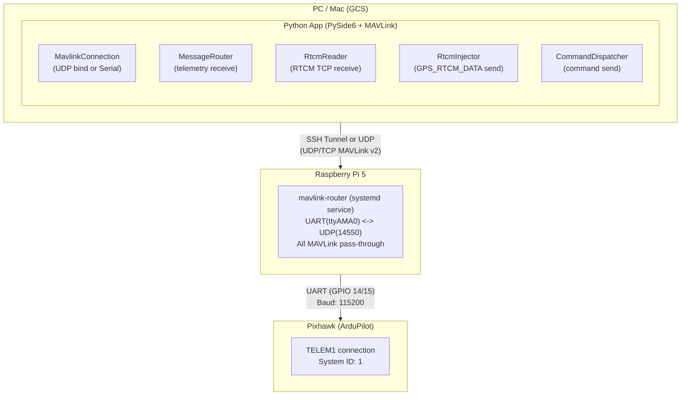

### 各ノードの役割

| ノード | 役割 |
|--------|------|
| **PC/Mac (GCS)** | MAVLinkテレメトリ受信・表示、コマンド送信（Arm/Disarm/Takeoff/Land/Guided）、RTCMデータ注入、GUI/Web UI提供 |
| **Raspberry Pi 5** | `mavlink-router` によるUART↔UDPブリッジ（純粋な透過中継）。Tailscale SSH 経由のリモート接続受付 |
| **Pixhawk (ArduPilot)** | フライトコントローラ。TELEM1経由でMAVLink通信。System ID: 1 |

---

## 2. 通信経路パターン一覧

### パターンA: SSHトンネル + Tailscale （`config/gcs_local.yml`）

**用途**: 本番（遠隔）接続。PC/Mac と Raspi が別ネットワークでも通信可能。
Tailscale の UDP 転送制限を回避するため、TCPベースのリレーを構築する。

**経路**:

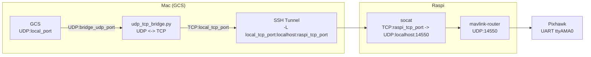

**使用ポート**:

| ポート | 場所 | 用途 |
|--------|------|------|
| 22 | SSH | Tailscale 経由のSSH接続 |
| 14550 | Raspi (mavlink-router) | mavlink-router UDPサーバー |
| 14551 | Raspi (socat) / Mac (SSH tunnel) | TCPリレーポート |
| 14552 | Mac (udp_tcp_bridge) | ブリッジUDPポート（GCSが送信先として使用） |

**socat ブリッジ**: あり。Raspi 側で `socat TCP-LISTEN:{raspi_tcp_port},fork,reuseaddr UDP:localhost:14550` を実行し、TCP→UDP変換を行う。

**自動セットアップ**: `main.py` 起動時に `_setup_tailscale_tunnel()` が以下を自動実行する:
1. SSH で Raspi にコマンド送信 → socat 起動（TCP:14551→UDP:14550）
2. SSH トンネル確立（`ssh -N -L 14551:localhost:14551`）
3. ローカルブリッジ起動（`scripts/udp_tcp_bridge.py 14552 14551`）

**gcs_local.yml パラメータ説明**:

| パラメータ | 型 | デフォルト | 説明 |
|-----------|------|-----------|------|
| `connection_type` | string | `udp` | 接続タイプ（常に `udp`） |
| `udp_listen_port` | int | `14550` | GCSがbindするUDPポート |
| `tailscale_tunnel.enabled` | bool | `true` | 自動トンネルセットアップの有効/無効 |
| `tailscale_tunnel.ssh_host` | string | `raspi` | SSH接続先ホスト名（`.ssh/config` のHost名） |
| `tailscale_tunnel.raspi_tcp_port` | int | `14551` | Raspi側socatがLISTENするTCPポート |
| `tailscale_tunnel.local_tcp_port` | int | `14551` | Mac側SSHトンネルのローカルTCPポート |
| `tailscale_tunnel.bridge_udp_port` | int | `14552` | ローカルUDP↔TCPブリッジがLISTENするUDPポート |
| `drones.drone1.system_id` | int | `1` | MAVLink System ID |
| `drones.drone1.endpoint` | string | `127.0.0.1:14552` | GCSのMAVLink送信先（bridge_udp_port） |
| `drones.drone1.name` | string | `Pixhawk6C Main` | ドローン表示名 |
| `rtcm_enabled` | bool | `false` | RTCM/RTKの有効/無効（SSHトンネルモードでは通常false） |


### パターンB: SSHトンネル手動 （`config/gcs_production.yml`）

**用途**: 本番接続（手動SSHトンネル管理）。

**経路**:

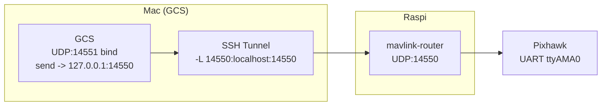

**SSH トンネル作成手順**（GCS起動前に別ターミナルで実行）:

```bash
# 方法1: Tailscale経由
ssh -L 14550:localhost:14550 -L 5760:localhost:5760 \
    -o ProxyCommand="tailscale nc %h %p" taki@100.123.158.105

# 方法2: 同一ネットワークまたは通常のSSH設定経由
ssh -L 14550:localhost:14550 -L 5760:localhost:5760 taki@raspi5.local
```

> `-L 5760:localhost:5760` は mavlink-router のTCPサーバーポートも転送（オプション）。

**ポートフォワーディング**:
- `local:14550` → `raspi:14550`（MAVLink通信）
- `local:5760` → `raspi:5760`（mavlink-router TCPサーバー、オプション）

**起動**:
```bash
export GCS_CONFIG_PATH=config/gcs_production.yml
export PYTHONPATH=$PYTHONPATH:$(pwd)/app
python app/main.py
```

**設定パラメータ**:

| パラメータ | 値 | 説明 |
|-----------|------|------|
| `connection_type` | `udp` | |
| `udp_listen_port` | `14551` | SSHトンネルが14550を使用するため別ポート |
| `drones.drone1.system_id` | `1` | |
| `drones.drone1.endpoint` | `127.0.0.1:14550` | SSHトンネル経由でlocalhost:14550に転送 |
| `drones.drone1.name` | `Pixhawk6C Main` | |
| `rtcm_enabled` | `false` | |

### パターンC: シリアル直接接続 （`config/gcs.yml` デフォルト）

**用途**: 開発・テスト。PCとPixhawkをUSB直結。

**経路**:

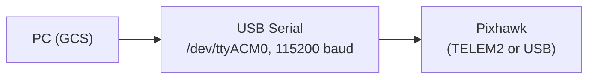

**設定パラメータ**:

| パラメータ | 値 | 説明 |
|-----------|------|------|
| `connection_type` | `serial` | |
| `serial_port` | `/dev/ttyACM0` | Pixhawk USBシリアルデバイス |
| `serial_baudrate` | `115200` | |
| `drones.drone1.system_id` | `1` | |
| `drones.drone1.endpoint` | `127.0.0.1:14550` | （シリアルモードでは未使用だが設定あり） |
| `udp_listen_port` | `14550` | （シリアルモードでは未使用だが設定あり） |
| `rtcm_enabled` | `true` | RTCM有効 |
| `rtcm_host` | `127.0.0.1` | RTCM TCPサーバーホスト |
| `rtcm_tcp_port` | `2101` | RTCM TCPサーバーポート |

### パターンD: Raspi上でGCS直接実行 （`config/gcs_drone.yml`）

**用途**: GCSをRaspi上で直接実行する場合。

**経路**:

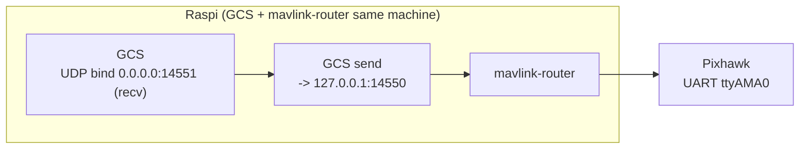

**設定パラメータ**:

| パラメータ | 値 | 説明 |
|-----------|------|------|
| `connection_type` | `udp` | |
| `udp_listen_port` | `14551` | 14550はmavlink-routerが使用中のため別ポート |
| `drones.drone1.system_id` | `1` | |
| `drones.drone1.endpoint` | `127.0.0.1:14550` | mavlink-routerのUDPサーバー |
| `drones.drone1.name` | `Pixhawk6C Main` | |
| `rtcm_enabled` | `false` | |
| `rtcm_host` | `127.0.0.1` | |
| `rtcm_tcp_port` | `2101` | |

**起動**:
```bash
cd GCS-UmemotoLab
source .venv/bin/activate
export GCS_CONFIG_PATH=config/gcs_drone.yml
export PYTHONPATH=$PYTHONPATH:$(pwd)/app

---

## 3. 設定ファイルの優先順位

設定ファイルは `rtk_tools/config_loader.py` の `resolve_config_path()` によって以下の優先順位で解決される:

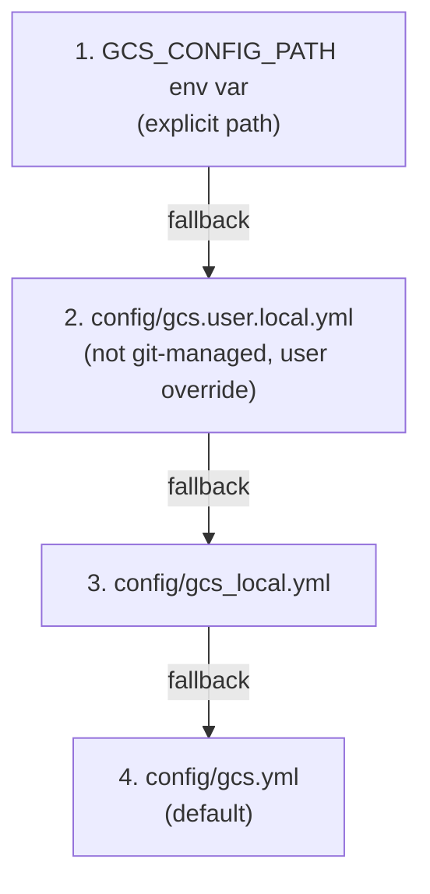

### 各ファイルの役割と使い分け

| ファイル | 用途 | Git管理 | 備考 |
|----------|------|---------|------|
| `config/gcs.yml` | デフォルト設定（シリアル接続） | ✅ | 開発・テスト用 |
| `config/gcs_local.yml` | SSHトンネル + socat + ブリッジ自動セットアップ | ✅ | 本番Tailscale接続の推奨設定 |
| `config/gcs_production.yml` | 手動SSHトンネル接続 | ✅ | 本番接続（手動管理） |
| `config/gcs_drone.yml` | Raspi上直接実行 | ✅ | Raspi上でGCSを実行する場合 |
| `config/gcs_sshtunnel.yml` | launch_gcs_tailscale.sh用 | ✅ | シェルスクリプト自動起動用 |
| `config/gcs_multidrone_test.yml` | マルチドローンテスト用 | ✅ | 拡張テスト用 |
| `config/gcs.user.local.yml` | ユーザー固有のローカル上書き | ❌ | `.gitignore` 対象。環境固有の設定を記述 |

---

## 4. MavlinkConnection クラス

**ファイル**: `app/mavlink/connection.py`

MAVLink通信（UDP/Serial）を管理するコアクラス。

### `__init__(config_path)`

- YAML設定ファイルを読み込み
- `connection_type` に応じてUDPソケットまたはシリアルポートを初期化
- **UDP モード**:
  - `socket(AF_INET, SOCK_DGRAM)` を作成
  - `SO_REUSEADDR` を設定
  - `0.0.0.0:{udp_listen_port}` に bind（デフォルト: 14550）
  - タイムアウト: 5.0秒
- **Serial モード**:
  - `serial_port`（デフォルト: `/dev/ttyACM0`）を設定
  - `serial_baudrate`（デフォルト: 115200）を設定
  - 遅延初期化（`start()` 後、受信ループ内で `serial.Serial()` をオープン）
- MAVLinkエンコード/デコード用 `mavutil.mavlink.MAVLink(bytearray())` を生成

### `start(recv_callback)`

- `running = True`
- 受信スレッドを `daemon=True` で起動
- `_recv_loop()` を実行

### `_recv_loop_serial()`

- シリアルポートが未オープンまたは切断されていれば再接続（指数バックオフ: 1.0 → 1.5 → 2.25 → ... → 最大5.0秒）
- `serial_conn.in_waiting > 0` の場合、全データを読み取り `recv_callback(data, (serial_port, 0))` を呼ぶ
- 連続エラーが `serial_max_errors`（5回）を超えると `SERIAL_CRITICAL` エラーコールバックを発火
- `SerialException` 発生時は接続をクローズし再接続を試みる

### `_recv_loop_udp()`

- `sock.recvfrom(4096)` で受信
- タイムアウト（連続30回）で `UDP_TIMEOUT` エラーコールバック発火
- `ConnectionResetError` → `UDP_CONNECTION_RESET` 発火
- エラー時は `packet_loss_count` をインクリメント

### エラーハンドリング

| エラー種別 | 検出条件 | 発火コールバック |
|-----------|----------|-----------------|
| `SERIAL_OPEN_FAILED` | シリアルポートオープン失敗 | `_trigger_error_callback()` |
| `SERIAL_CRITICAL` | 連続5回のシリアルエラー | 同上 |
| `SERIAL_SEND_FAILED` | シリアルポートが開いていない状態での送信試行 | 同上 |
| `SERIAL_SEND_ERROR` | シリアル書き込み例外 | 同上 |
| `UDP_TIMEOUT` | 連続30回のUDPタイムアウト | 同上 |
| `UDP_CONNECTION_RESET` | ConnectionResetError | 同上 |
| `UDP_ERROR` | その他UDP例外 | 同上 |

### `send(system_id, data)`

- **Serial モード**: `serial_conn.write(data)` でPixhawkに直接送信
- **UDP モード**: `drones` 設定から `system_id` に一致するエンドポイントを探し、`sock.sendto(data, (ip, port))` で送信
- 戻り値: `bool`（送信成功/失敗）

### `send_to_system(system_id, data)`

- `send()` のエイリアス。明示的に「対象システム」を指定する場合に使用。

> **注意**: README内ではファイル名を `gcs_raspi_direct.yml` と表記しているが、実ファイル名は `gcs_drone.yml`。


> **注意**: `gcs_production.yml` では `tailscale_tunnel` セクションが**ない**。SSHトンネルは手動で管理する。


---

## 5. MAVLink メッセージフロー

### 上り（テレメトリ）: Pixhawk → GCS

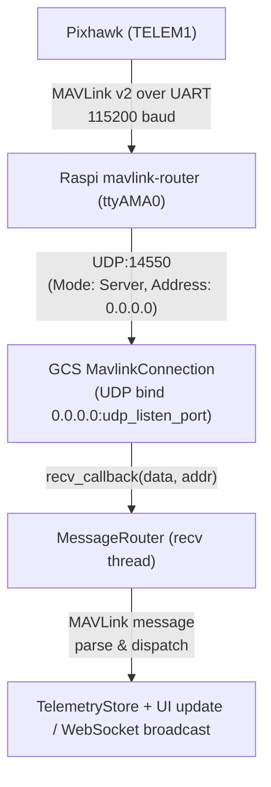

### 下り（コマンド）: GCS → Pixhawk

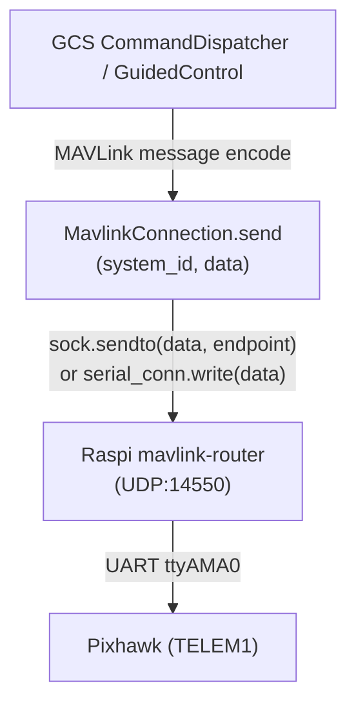

### RTCM/RTK データフロー

RTK 補正データは以下のパイプラインで F9P 基地局から Pixhawk まで到達する。

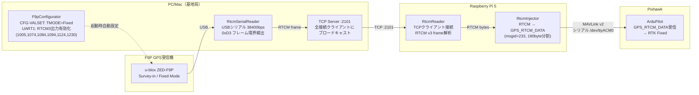

#### パイプライン詳細

| 段階 | 担当モジュール | 実行場所 | データ形式 | 説明 |
|------|---------------|----------|-----------|------|
| **① F9P設定** | `F9pConfigurator` (rtk_tools/f9p_configurator.py) | PC/Mac | CFG-VALSET (UBX) | Fixed Mode設定、RTCM3出力メッセージ有効化。`rtk_base_station_v2.py`が起動時に自動実行 |
| **② RTCM受信** | `RtcmSerialReader` (rtk_base_station_v2.py) | PC/Mac | RTCM3 frame | F9PからUSBシリアル経由でRTCM3フレーム受信。先頭バイト0xD3でフレーム境界検出 |
| **③ TCP転送** | TCP Server (rtk_base_station_v2.py) | PC/Mac | RTCM3 frame | 受信フレームをTCP:2101に接続した全クライアントにブロードキャスト |
| **④ RTCM受信(Raspi)** | `RtcmReader` (app/rtk_tools/rtcm_reader.py) | Raspi | RTCM3 frame | TCP:2101にクライアント接続しRTCM3フレーム受信。CRC-24簡易検証 |
| **⑤ MAVLink変換** | `RtcmInjector` (app/rtk_tools/rtcm_injector.py) | Raspi | GPS_RTCM_DATA (msgid=233) | RTCMバイト列→MAVLink v2 GPS_RTCM_DATAフレーム（180byte/フレーム自動分割、CRC-16 CCITT付与） |
| **⑥ Pixhawk注入** | `MavlinkConnection.send_to_system()` | Raspi | MAVLink v2 | シリアル /dev/ttyACM0 経由でPixhawkに送信。全System IDにブロードキャスト |

#### 基地局起動方法

```bash
# v2（推奨）: F9P自動設定統合版
python rtk_tools/rtk_base_station_v2.py --config config/base_station.json --tcp-port 2101

# v1: 手動F9P設定前提
python rtk_base_station.py --serial-port COM8 --baudrate 115200 --tcp-host 0.0.0.0 --tcp-port 2101
```

#### 設定ファイル（config/base_station.json）

```json
{
  "fixed_lat": 35.681236,
  "fixed_lon": 139.767125,
  "fixed_alt": 42.0,
  "baudrate": 38400,
  "serial_port": "/dev/tty.usbmodem113301"
}
```

#### コードパス（backend_server.py の連携）

```python
# 受信→注入→送信のコールバック連鎖
rtcm_reader = RtcmReader(host=rtcm_host, port=rtcm_port, enabled=rtcm_enabled)
rtcm_injector = RtcmInjector(enabled=rtcm_enabled)

def on_rtcm_data(data):
    rtcm_injector.inject(data)          # RTCM → MAVLink GPS_RTCM_DATA

def send_rtcm_message(frame_data):
    mav_conn.send_to_system(1, frame_data)  # Drone 1 へ送信
    mav_conn.send_to_system(2, frame_data)  # Drone 2 へ送信（マルチドローン）

rtcm_injector.set_send_callback(send_rtcm_message)  # 注入→送信
rtcm_reader.register_callback(on_rtcm_data)          # 受信→注入
rtcm_reader.start()                                   # 受信開始
```

---

## 6. mavlink-router の役割

**mavlink-router** は Raspberry Pi 5 上で動作する `systemd` サービスで、以下の役割を担う:

- **純粋な UART ↔ UDP ブリッジ**: カスタムメッセージを含む全てのMAVLinkトラフィックを透過的に通過させる
- **プロトコル変換**: Pixhawk側のUART（ttyAMA0）とGCS側のUDP（14550）を双方向に中継
- **複数エンドポイント対応**: 設定次第で複数のUDPクライアントに同時配信可能

### 設定ファイル: `/etc/mavlink-router/main.conf`

```ini
[General]
ReportStats=true

[UartEndpoint pixhawk]
Device = /dev/ttyAMA0
Baud = 115200

[UdpEndpoint gcs]
Address = 0.0.0.0
Port = 14550
Mode = Server
```

### サービスの管理

```bash
sudo systemctl enable mavlink-router
sudo systemctl start mavlink-router
sudo systemctl status mavlink-router
```

### Raspi 配線 (Pixhawk TELEM1 ↔ Raspi GPIO)

| Pixhawk TELEM1 | Raspi GPIO | 物理Pin |
|----------------|------------|---------|
| TX → | GPIO 15 (RX) | Pin 10 |
| RX → | GPIO 14 (TX) | Pin 8 |
| RTS → | GPIO 17 | Pin 11 |
| CTS → | GPIO 16 | Pin 36 |
| GND → | GND | Pin 6 |

### UART有効化 (`/boot/firmware/config.txt`)

```
enable_uart=1
dtoverlay=uart0

---

## 7. ポート使用一覧表

| ポート | プロトコル | 場所 | 用途 | 関連設定ファイル |
|--------|-----------|------|------|-----------------|
| 22 | TCP (SSH) | Raspi | SSH接続（Tailscale経由含む） | `~/.ssh/config`, `tailscale_setup_raspi.sh` |
| 14550 | UDP | Raspi | mavlink-router UDPサーバー (Mode: Server) | `/etc/mavlink-router/main.conf` |
| 14550 | UDP | Mac | SSHトンネル転送先（パターンB: GCS bindingではなく受信に使用） | `gcs_production.yml` (`endpoint: 127.0.0.1:14550`) |
| 14551 | UDP | Mac/GCS | GCS UDP待受ポート（パターンB/D: 14550と競合回避のため） | `gcs_production.yml`, `gcs_drone.yml` |
| 14551 | TCP | Raspi | socat TCP-LISTEN ポート（パターンA） | `gcs_local.yml` (`raspi_tcp_port`) |
| 14551 | TCP | Mac | SSHトンネルローカルポート（パターンA） | `gcs_local.yml` (`local_tcp_port`) |
| 14552 | UDP | Mac | udp_tcp_bridge.py の受信ポート（パターンA） | `gcs_local.yml` (`bridge_udp_port`) |
| 5760 | TCP | Raspi | mavlink-router TCPサーバー（補助） | `/etc/mavlink-router/main.conf` (オプション) |
| 2101 | TCP | 任意 | RTCM/RTK NTRIP デフォルトポート | `gcs.yml` (`rtcm_tcp_port`) |
| 41641 | UDP | Raspi | Tailscale (tailscaled デフォルトポート) | `/etc/default/tailscaled` |

---

## 8. 設定ファイルの全パラメータリファレンス

### 全設定ファイル共通パラメータ

| パラメータ | 型 | デフォルト | 説明 |
|-----------|------|-----------|------|
| `connection_type` | string | `udp` | 接続タイプ: `serial` または `udp` |
| `serial_port` | string | `/dev/ttyACM0` | シリアル接続時のデバイスパス |
| `serial_baudrate` | int | `115200` | シリアル接続時のボーレート |
| `udp_listen_port` | int | `14550` | UDP接続時のbindポート |

### `drones` セクション

| パラメータ | 型 | 必須 | 説明 |
|-----------|------|------|------|
| `drones.{name}.system_id` | int | ✅ | MAVLink System ID（通常1） |
| `drones.{name}.endpoint` | string | ✅ | `IP:PORT` 形式のMAVLinkメッセージ送信先 |
| `drones.{name}.name` | string | ❌ | ドローン表示名 |

### `rtcm` セクション

| パラメータ | 型 | デフォルト | 説明 |
|-----------|------|-----------|------|
| `rtcm_enabled` | bool | `true` | RTCM/RTK補正データ注入の有効/無効 |
| `rtcm_host` | string | `127.0.0.1` | RTCM TCPサーバーのホスト |
| `rtcm_tcp_port` | int | `2101` | RTCM TCPサーバーのポート |

### `tailscale_tunnel` セクション（パターンA専用）

| パラメータ | 型 | デフォルト | 説明 |
|-----------|------|-----------|------|
| `tailscale_tunnel.enabled` | bool | `true` | 自動SSHトンネルセットアップの有効/無効 |
| `tailscale_tunnel.ssh_host` | string | `raspi` | SSH接続先ホスト名（`~/.ssh/config` のHost名） |
| `tailscale_tunnel.raspi_tcp_port` | int | `14551` | Raspi側socat TCP LISTENポート |
| `tailscale_tunnel.local_tcp_port` | int | `14551` | Mac側SSHトンネルのローカルTCPポート |
| `tailscale_tunnel.bridge_udp_port` | int | `14552` | ローカルUDP↔TCPブリッジのUDPポート |

---

## 9. 接続パターン早見表

| パターン | 設定ファイル | 接続方式 | 環境 | 自動セットアップ |
|----------|-------------|----------|------|-----------------|
| A | `gcs_local.yml` | SSH Tunnel + Tailscale + socat + UDP↔TCP Bridge | 本番（遠隔） | ✅ `_setup_tailscale_tunnel()` |
| B | `gcs_production.yml` | 手動SSHトンネル | 本番（遠隔） | ❌ 手動で `ssh -L` 実行 |
| C | `gcs.yml` | USBシリアル直結 | 開発 | ❌（不要） |
| D | `gcs_drone.yml` | Raspi上でGCS直接実行 | Raspi上 | ❌（不要） |

---

## 10. 起動スクリプトと自動化

### `scripts/launch_gcs_tailscale.sh`

パターンAを手動でセットアップする場合のシェルスクリプト:

```bash
# 1. Raspi側socatブリッジ起動
ssh raspi 'pkill socat 2>/dev/null; sleep 1
socat TCP-LISTEN:14551,fork,reuseaddr UDP:localhost:14550 &'

# 2. SSHトンネル確立
ssh -f -N -L 14551:localhost:14551 -o ConnectTimeout=15 -o ServerAliveInterval=30 raspi

# 3. UDP-TCPブリッジ起動
python3 /tmp/udp_tcp_bridge.py &

# 4. GCS起動
export GCS_CONFIG_PATH=config/gcs_sshtunnel.yml
python app/main.py
```

設定ファイルは `config/gcs_sshtunnel.yml` を使用（`gcs_local.yml` と同一内容）。

### `scripts/udp_tcp_bridge.py`

パターンAのローカルUDP↔TCPブリッジ:

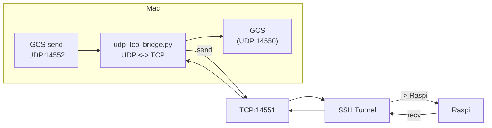

- **UDP受信**: `127.0.0.1:{bridge_udp_port}` でGCSからのMAVLinkメッセージを受信
- **TCP送信**: SSHトンネルのローカルTCPポート `127.0.0.1:{tunnel_tcp_port}` に転送
- **TCP受信**: SSHトンネル経由でRaspiからのMAVLinkメッセージを受信
- **UDP送信**: GCSのUDP受信ポート `127.0.0.1:14550` に転送

### `scripts/tailscale_setup_raspi.sh`

Raspberry Pi 5 の初回セットアップスクリプト:
1. Tailscale 静的バイナリ（v1.98.4, arm64）のダウンロード・インストール
2. `tailscaled` systemd サービスの起動・有効化
3. `sudo tailscale up --accept-routes --ssh` による認証

---

## 11. データフロー完全図

### 11.1 GCS 内部データフロー (PC/Mac)

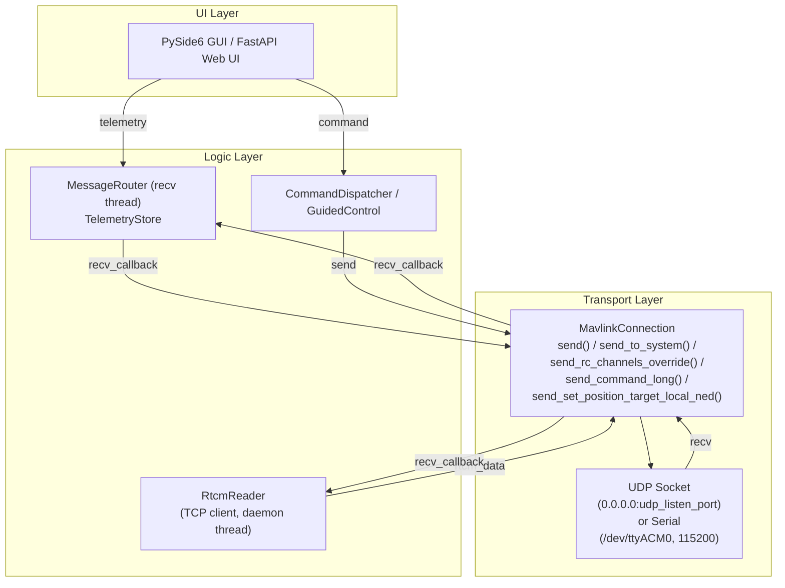

### 11.2 エンドツーエンド通信経路

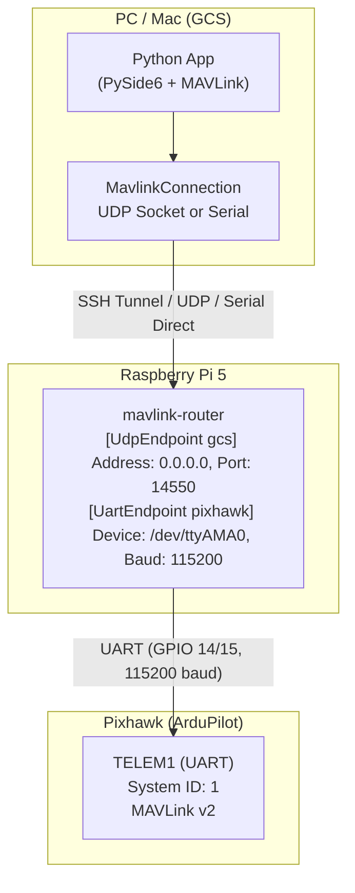

---

## 12. 参考資料

- [MAVLink Protocol](https://mavlink.io/en/)
- [ArduPilot Docs](https://ardupilot.org/dev/)
- [pymavlink](https://github.com/ArduPilot/pymavlink)
- [mavlink-router](https://github.com/mavlink-router/mavlink-router)
- [PySide6](https://doc.qt.io/qtforpython/)
- [Tailscale](https://tailscale.com/)
