福井大学大学院工学研究科

「数値流体力学」

太田貴士

## 目次

第1章流れの数値シミュレーションの準備 1  
1.1 計算格子 1  
1.2 プログラミング言語 6  
1.3 流れの数値シミュレーションの実行環境： 6  
第2章 移流方程式の数値シミュレーション（中心差分） 9  
2.1 非圧縮性流れの基礎方程式. 9  
2.2 移流方程式 10  
2.3 中心差分による離散化 10  
第3章 拡散方程式の数値シミュレーション 15  
3.1 拡散方程式 15  
3.2 離散化 15  
3.3 安定条件(拡散数) 15  
第4章 移流方程式の数値シミュレーション（上流差分） 19  
4.1 数值振動 19  
4.2 上流化，風上差分 19  
4.3 数值拡散 20  
4.4 QUICK法 20  
4.5 その他の計算方法 22  
第5章 非圧縮性流れの数值解析法（MAC系解法） 27  
5.1 非圧縮性流れ数值解析法の概要 27  
5.2 非圧縮性流れ数値解析のための計算格子 27  
5.3 SMAC法による時間進行計算 28  
5.4 SMAC法における空間離散化 30  
5.5 SMAC法における境界条件 32  
5.6Fractional Step 法による時間進行計算 33  
第6章 非圧縮性流れの数值解析法（SIMPLE系解法） 35  
6.1 SIMPLE法による（時間進行）計算 35  
6.2 MAC 系解法とSIMPLE 系解法の比較 37  
第7章外的作用の影響を受ける流れの数値シミュレーション 39  
7.1 外力が作用する場合の流れの基礎方程式 39  
7.2 熱と浮力の影響. 39  
7.3 電磁力の影響 40  
第8章 乱流の数値シミュレーション（RANS) 45  
8.1 乱流の数値シミュレーション 45  
8.2 レイノルズ平均による乱流の数値シミュレーション 46  
第9章 乱流の数値シミュレーション（LES) 55  
9.1 格子平均による乱流の数値シミュレーション 55  
9.2 基礎方程式 56  
9.3 Smagorinsky・モデル 57  
9.4 ダイナミックモデル 59  
9.5 ガリレイ不変性. 60

# 第1章

# 流れの数値シミュレーションの準備

## 1.1 計算格子

## 1.1.1 計算格子の種類

流れ場内のすべての点で流れの基礎方程式(通常は連立偏微分方程式)が成り立っていると考える.そのような場合でも，計算機で液体や気体などの連続体の動きを再現するためには，無限個の点の代わりに，離散的に配置された有限個の点の上で，速度や圧力などの物理量を定義して，何らかの数値解析法で基礎方程式を解かなければならない。このとき，流れの物理量が定義された点の配置を表すために流れ場を分割した領域を「計算格子」という。

最も基本的な計算格子として「デカルト座標格子」がある。この計算格子では，流れの基礎方程式は比較的単純な形になるので，数値解析のためのプログラミングが容易である：しかし，より複雑な流れのような一般的な状況を考えると，基礎方程式の数値計算を精度良く実行するためには，計算格子の配置(物理量の定義位置，流れ場の分割方法)に注意しなければならない.

流れ場の形状や流動形態に応じた計算格子の配置方法が考えられる．例えば，壁に沿って滑らかな配置や，流れが複雑になっている部分に物理量の定義点が多くなるように寄せた配置がある．壁に沿って滑らかに配置させた計算格子を「境界適合格子」という．計算精度を維持するためには，計算格子の配置（寄せ具合など）を注意深く設定しなければならない．複雑な形状の物体周りの流れを対象にする場合は，職人的な技術を要することもあるが，その結果として適当な計算格子を構築できれば，高精度な流れの数値解析を期待できる.

デカルト座標格子や境界適合格子のように，何らかの規則に従って滑らかに配置させてある計算格子を「構造格子」という.それに対して，必ずしも規則正しく配置させることなく，必要な部分に重点的に置きながら，流れ場を分割する計算格子を「非構造格子」という。非構造格子は，固体力学の数値ミュレーションではー般的に使用されているようであるが，流体力学の数値シミュレーションでは使用されることが比較的少ない。あるいは，企業で実用的に利用される商用ソフトウェアでは，手軽に結果を得るために，非構造格子が使われるとが多いようである、それに対して，大学における研究のように，高精度な解析を目指す数値流体力学においては，デカルト座標格子を使用するか，または，さらに高精

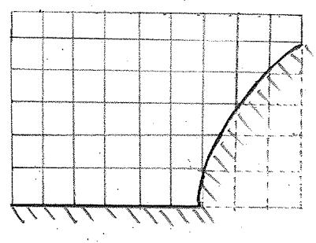

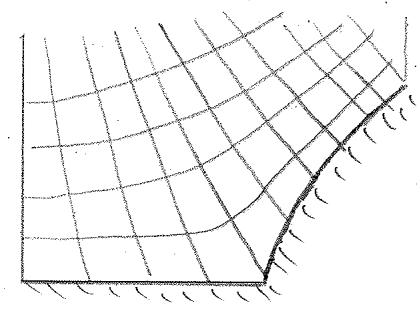

図1.1：構造格子（デカルト座標格子）の例

図1.2:構造格子（境界適合格子）の例

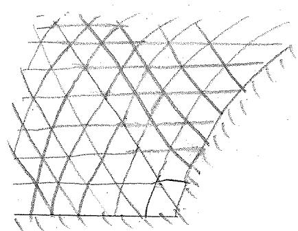  
図1.3:非構造格子の例

度な計算を実現するために，適当な境界適合格子を用意 $L \tau ,$ その計算格子に応じた数値計算法を採用するこどになる，以下では，特に境界適合格子を説明する.

境界適合格子の配置を決めるということは，物理空間 $x - y$ の点と計算空間ξ一ηの点の間の座標変换(写像)

$$
x = x ( \xi , \eta )
$$

$$
y = y ( \xi , \eta )\tag{1.1}
$$

を決めることである．主にプログラミングのための仮想的な計算格子の設定は任意であるが，通常は，離散化を容易にするために，格子間隔が単位長さの直交等間隔格子とする.

物体周りの流れの数値シ $\vdots \downarrow \downarrow - \vdots \equiv \downarrow \uparrow$ 採用される基本的な境界適合格子は，物体形状によって，例えば，O型格子，C型格子，H型格子，L型格子に分類できる.これら以外にも，そのときの状況に$\sum 3 T$ ，独自の分布形状を利用した例もあるし，今後も，新たに提案できるであろう。

計算格子の分布形状は，物体形状によって自動的に決定されることもあるが，解析結果の局所的な精度や全体の信頼性に影響することがあるので，それぞれの特徴を考慮して，注意深く選択しなければならない。例えば，〇型格子は，全体的に滑かで歪みの少ない形状であり，物体周りに無駄なく均等に格子点を配置できる。しかし，物体形状に尖った部分があると，その付近で歪みが生じてしまう．また，後流のように物体から離れた流域で十分な密度で格子点を配置できないことも問題になる．C型格子は，格子点が物体周りの流れに沿って分布しており，遠方の後流領域にも格子点が分布している．ただし，格子の接合部分における滑かさやプログラミングには注意しなければならない．また，物体形状に加えて，外部境界条件の制約によっては，H型格子，L型格子などを採用することが望ましい場合もある.

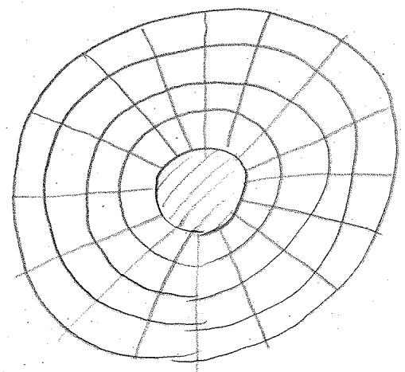  
図1.4:O型格子の例

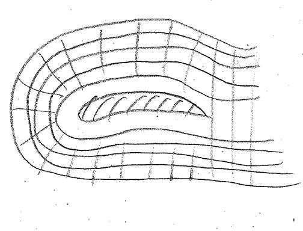  
図1.5:C型格子の例

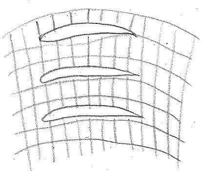  
図1.6:H型格子の例

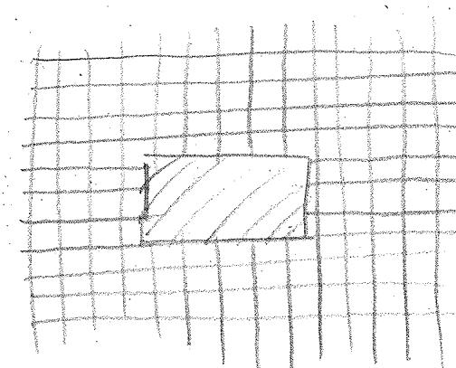  
図1.7：L型格子の例

複数の物体が存在する場合のように，さらに複合的な状況を考慮しなければならないときには，単一の格子形状の計算格子を生成することが困難になる，その場合には，複数の計算格子を組み合せた「重合格子」「接合格子」「複合格子」を採用することになる．通常，これらの計算格子では，プログラミングが困難になったり，計算効率が低下するので，そのようなデメリットを回避する工夫が必要になる.

格子形状の種類を選択したあとは，流れ場の形状に適合した格子点の配置を決定することになる．通常は適当なアルゴリズムによって自動生成されるが，その場合でも，望ましい格子形状になるように，パラメーターを手動で調整しなければならない．また，実際に数値シミュレーションを実行して，計算結果を見ながら，パラメーターを再調整しなければならないこともある.すなわち，流れの数値シミュ$V - i \geq V$ は，格子生成の段階から，流体力学の知識を有した人間の適切な判断に強く依存している.

## 1.1.2一般曲線座標系格子における微分計算

境界適合格子のように必ずしも座標系が直線で直交しているとは限らない構造格子の場合に，速度や圧力などの物理量の空間微分を数値解析で計算する方法を考える。このような座標系を「一般曲線座標系」「非直交曲線座標系」などと呼ぶ.

一般曲線座標系で表される物理空間 $x - y$ と，直交等間隔な座標系で表される計算空間 $\xi - \eta$ の間の座標変換(1.1)が決められていると，次のように，物理量φの空間微分を表示できる.

$$
\frac { \partial \phi } { \partial x } = \frac { \partial \phi } { \partial \xi } \frac { \partial \xi } { \partial x } + \frac { \partial \phi } { \partial \eta } \frac { \partial \eta } { \partial x }\tag{1.2}
$$

$$
\frac { \partial \phi } { \partial y } = \frac { \partial \phi } { \partial \xi } \frac { \partial \xi } { \partial y } + \frac { \partial \phi } { \partial \eta } \frac { \partial \eta } { \partial y }\tag{1.3}
$$

この中の $( x , y ) ~ \xi , ( \xi , \eta )$ の関係を表している波線部分をあらかじめ準備しておけば，直交等間隔なデカルト座標系格子で計算で $\yen 523,456,789$ から $\partial \phi / \partial x \ \xleftarrow { } \partial \phi / \partial y$ が求められる。 $( x , y ) \ \xi \ ( \xi , \eta ) \ \mathcal { O }$ 関係を表している波線部分については，

$$
\left( \frac { \partial \xi } { \partial x } \begin{array} { l l } { \displaystyle \frac { \partial \xi } { \partial y } } \\ { \displaystyle \frac { \partial \eta } { \partial x } } \end{array} \right) \left( \frac { \partial x } { \partial \xi }  & { \displaystyle \frac { \partial x } { \partial \eta } } \\ { \displaystyle \frac { \partial \eta } { \partial x } } & { \displaystyle \frac { \partial \eta } { \partial y } \right) \left( \frac { \partial y } { \partial \xi } \right)} &  \displaystyle \frac { \partial y } { \partial \eta }  = \left( \frac { \partial \xi } { \partial \xi } \begin{array} { l l } { \displaystyle \frac { \partial \xi } { \partial \eta } } \\ { \displaystyle \frac { \partial \eta } { \partial \xi } } & { \displaystyle \frac { \partial \eta } { \partial \eta } } \end{array} \right) = \left( \begin{array} { l l } { \displaystyle 1 } & { \displaystyle 0 } \\ { \displaystyle 0 } & { \displaystyle 1 } \end{array} \right)\tag{1.4}
$$

$$
\left( \frac { \partial \xi } { \partial x } \begin{array} { c c } { \displaystyle \frac { \partial \xi } { \partial y } } \\ { \displaystyle \frac { \partial \eta } { \partial x } } \end{array} \right) = \left( \begin{array} { c c } { \displaystyle \frac { \partial x } { \partial \xi } } & { \displaystyle \frac { \partial x } { \partial \eta } } \\ { \displaystyle \frac { \partial y } { \partial \xi } } & { \displaystyle \frac { \partial y } { \partial \eta } } \end{array} \right) ^ { - 1 }\tag{1.5}
$$

となるので，式(1.1)から式(1.5)の右辺の微分と逆行列を数値的に計算して求められる.

## 1.1.3 計算格子の条件

流れの数値シミュレーションにおいて，望ましい計算格子とはどのようなものであるか、数値解析法の観点および流れの数値 $\yen 123,456$ 過去の経験から知られている注意すべき点として，以下の項目がある.

## 格子の直交性

速度のようなべクトル値は計算格子に沿う各方向成分で表現される．ベクトルを高精度に表現するためには，座標格子が直交していることが望ましい.

## 格子間隔，格子曲率の滑らかさ

計算格子点の間隔が急激に（あるいは不連続に）変化すると，境界適合座標を決める座標変換の導関数が極端に大きく（不連続に）なる。この場合，数値解析で誤差が発生して，数値シミュレーションが不安定になる。また，計算格子が急激に曲がっていると，差分や補間の信頼性が低くなり，その結果として，数値計算で誤差あるいは不安定の原因になる．境界形状に適合しつつも，格子の曲りが空間的に集中しないように注意すべきである.

## 壁近くの解像度

壁近くの境界層内で，物理量の分布を物理的に的確に表現できるほどの格子解像度がなければならない。また，壁近くに限らず，物理量の変化が大きい領域で十分な解像度が設定されている必要がある。ただし，計算領域の一部分に計算格子を集中させようとすると，その付近の格子配置が不自然になり，滑らかさが損われるおそれがあるので，広い視点で格子点の寄せ具合を調整しなければならない。

## 1.1.4 計算格子の生成法

良い計算格子の条件を満たすように，計算格子を生成する方法がいくつか提案されている，比較的単純な流れ場形状であれば，解析的な関係式で決めることができる。それに対して，一般的な形状の場合には，偏微分方程式を解く方法が採用されることが多い.

ポテンシャル流れや熱伝導問題のアナロジーから考えて，楕円型偏微分方程式

$$
\frac { \partial ^ { 2 } \xi } { \partial \dot { x } ^ { 2 } } + \frac { \partial ^ { 2 } \xi } { \partial y ^ { 2 } } = P ( \xi , \eta ) .
$$

$$
\frac { \partial ^ { 2 } \eta } { \partial x ^ { 2 } } + \frac { \partial ^ { 2 } \eta } { \partial y ^ { 2 } } = \dot { Q } ( \xi , \eta ) \mathrm { ~ }\tag{1.6}
$$

によって，計算格子の座標点æ,yを求める．右辺のP,Qは格子配置の寄せ具合を調整するためのソース項(例えば，ポテンシャル流れにおける吹き出しと吸い込み，熱伝導問題における熱源)である．また，外部流れの計算格子として，双曲型偏微分方程式に格子直交性の条件を付加して解くこともある.流れの解析結果によって，格子点配置を半自動的に調整する方法も存在する，例えば，速度勾配が大きくなっている部分に，解像度を高めるために格子点を集中させることがある．そのような計算格子を「解適合格子」という．特に，格子点を自由に配置できる非構造格子と組み合されて，企業で実用的に利用される例が多いようである．ただし，その計算結果を受け入れる前に，流体力学的に妥当であることを注意深く検証しなければならない.

流れの数値シ $\yen 123,456$ 方法は，計算格子の種類に依存する部分もあるが，多くの手順は共通しており，数値流体力学の出発点においてその共通部分を理解することが将来の発展のためにも重要である。この後，流れの基礎方程式を解く数値 $\yen 123,456$ 各手法を理解する。しばらくの間は，離散化の手順が単純なデカルト座標格子を前提にして，数値シ $\yen 123,456$ ための数値解析法に集中して説明する.

## 1.2プログラミング言語

現在，大規模な科学技術計算を実行するための専用の高性能計算機で使用できるプログラミング言語は，「FORTRAN77,Fortran90」と「C,C++」がー般的である.これらのプログラミング言語は，歴史が古く，現代のプログラミング手法から見ると，必ずしも便利であるとは言えない。しかし，過去からの経緯と実績によって，現在でも最先端の現場で利用されている．なお，身近な高性能計算機であれば，さらに現代風の高級言語を利用することも可能であるので，数値シ $\yen 123,456$ を実行する環境とプログラマーの技術に応じて選択することになる.

実際に数値シミュレーションを実行するためには，プログラミング言語それぞれのルールを覚えなければならないが，数値流体力学の手法を理解するためには，その知識は必ずしも必要ではない。今後は，$7 ^ { \circ }  5 ^ { \circ }  \gamma ^ { \circ }$ 言語にできる限り依存しないように，数値 $\yen 123,456$ 手法を説明する.

## 1.3　流れの数値シミュレーションの実行環境

数値計算で使用される計算機は，計算の中枢部分であるCPUとその周りのハードウェアの構造によって分類できる。

科学技術に関わる計算機には「スカラー型計算機」と「ベクトル型計算機」がある．身近なパソコンを含めてほとんどの計算機はスカラー型である．それに対して，ベクトル型は，ベクトルの成分計算のように大規模な繰り返し計算を効率良く処理する機能が組み込まれている．数値計算 $\cdot T ^ { \prime } ( 2 ) = 0$ 改良だけではく，プログラミング言語のルールの範囲内で，それぞれの環境の特性を活用するためのプロ$1 5 5 \div 5 5$ 上の工夫が必要である. $7 1 5 7 \div > > 5 0 )$ 内容によっては，計算時間が数倍，数十倍，あるいはそれ以上に違ってしまう。

なお，ほとんどのべクトル型計算機はスカラー型計算機に比べて数桁価格が高いために，使用できる環境が限られている．また，開発の負担が大きく，商業上の理由から，以前に比べて，べクトル型計算機のメーカーが少なくなり，スカラー型計算機に移行している.ー般的に，流れの数値シミュレーションには，ベクトル型計算機が適していると考えられているが，今後はこれまで以上に，スカラー型においても効率良く数値シミュレーションを実行できるように，数値解析法を発展させていかなければならない.

単独の計算機の性能向上が頭打ちになってきたときをきっかけに，並列型計算機を使用する機会が多くなっている．近年のほとんどの高性能計算機が並列型になっており，スカラー型とべクトル型の区別に限らず，並列度の高さによって計算機トータルの性能が決まることになっている．並列型計算機は，CPUとメモリの関係によって，「分散型並列計算機」と「共有型並列計算機」に分類できる.

「分散型並列計算機」では，CPUとメモリの組み合せを増やすことによって，計算機トータルの理論性能を容易に向上できるが，分散しているメモリに計算中のデータを効率良く分配させなければならず，そのためのプログラミング技術が必要になる.ー般的に，流れの数値シミュレーションには適していないので，計算機性能を使いこなすためにプログラマーに負担がかかる.

「共有型並列計算機」では，計算中のデータをまとめて一箇所で保存して，そのメモリに対して複数のCPUがアクセスしながら計算処理を実行するので，データの保管と処理が容易になる，ただし，ハードウェア上の制約により，CPUを多くできないために，分散型のように計算機トータルの性能向上が望めない。したがって，CPU単体の高性能化を進めなければならないが，そのために，例えば，各CPUにベクトル型を採用することが考えられる.

以上のことから，大規模な流れの数値シミュレーションを効率良く手軽に実行するためには，ベクトル型共有型並列計算機が適しているが，この構成では最も贅沢な計算機になってしまう.

## この章のポイント

・計算格子はどのように分類されるか。また，計算対象に応じて，どのような種類があるか.

一般的に，計算格子に望ましい条件は何か.

・計算環境として，どのようなソフトウェアがあるか：また，ハードウェアがあるか.

## 第2章

移流方程式の数値シミュレーション（中心差分）

## 2.1 非圧縮性流れの基礎方程式

密度の変化が無視できる状況における流体の動きを「非圧縮性流れ」という，非圧縮性流れの基礎方程式は，連続の式と運動方程式である，流れの運動方程式はNavier-Stokes方程式ともいう，基礎方程式は微分方程式で記述できるが，微分方程式には，さまざまな数学的な観点から見て，複数の表現方法が存在する。まずはじめに，微分方程式に含まれる各項を見て，個別の記述方法に依存しない本来の物理的意味を理解することが重要である。

例えば，流れ場を2次元に限って，流速 $u , v$ と压力分布 $\mathcal { p }$ を含む基礎方程式をデカルト座標成分で表示すると，次のようになる．ただし，これ以降では，圧力pに一定値の密度ρが含まれているものとして，式中には密度 $\overset { \cdot } { \rho }$ を表示していない.

連続の式

$$
\frac { \partial u } { \partial x } + \frac { \partial v } { \partial y } = 0\tag{2.1}
$$

運動方程式

$$
\frac { \partial u } { \partial t } = - u \frac { \partial u } { \partial x } - v \frac { \partial \dot { u } } { \partial y } - \frac { \partial p } { \partial x } + \nu \left( \frac { \partial ^ { 2 } u } { \partial x ^ { 2 } } + \frac { \partial ^ { 2 } u } { \partial y ^ { 2 } } \right) .\tag{2.2}
$$

$$
\frac { \partial v } { \partial t } = - u \frac { \partial v } { \partial x } - v \frac { \partial v } { \partial y } - \frac { \partial p } { \partial y } + \nu \left( \frac { \partial ^ { 2 } v } { \partial x ^ { 2 } } + \frac { \partial ^ { 2 } v } { \partial y ^ { 2 } } \right)\tag{2.3}
$$

このとき，運動方程式には時間微分項が含まれているので，流れの状態が時間的に変化する「非定常流れ」を表現 $L T V : \beta$ .非定常流れであっても，連続の式は，時間に依存せ ${ \vec { \mathfrak { s } } } ^ { \mathfrak { r } } ,$ 常に成 $) \frac { 1 } { 1 1 } > T _ { 1 } > \frac { 1 } { 2 }$ . 運動方程式によると，速度（運動量）の時間変化は，時間微分項以外の項の総和によって決定されることがわかる.運動方程式の右辺第1項は対流項または移流項，第2項は圧力勾配項，第3項は粘性項または拡散項と呼ばれる，移流項と拡散項は，速度成分とその偏微分だけであり，そのときの流れの状況によって決まる効果を表現している，圧力勾配項は，速度分布とは直接関係なく，圧力分布によって決まる.微分方程式が記述する物理現象の性質を知るために，運動方程式の中の各項に注目して，その微分方程式の性質を詳しく調べる．ここでは，1次元の流れ場を想定して，運動方程式を単純化する．まず，速度の時間変化に影響する移流項の性質を調べるために，それら以外の項を省く，次の微分方程式を「移流方程式」という。

$$
\frac { \partial u } { \partial t } = - u \frac { \partial u } { \partial x }\tag{2.4}
$$

移流方程式の移流項は速度と速度の偏微分の積になっているので，非線形微分方程式である。なお，連続の式を使うと，次のように変形でき，非線形微分方程式であることが明示的になる.

$$
\frac { \partial u } { \partial t } = - \frac { \partial u u } { \partial x }\tag{2.5}
$$

次に，速度の時間変化に影響する粘性項の性質を見る。これを「拡散方程式」という.

$$
\frac { \partial u } { \partial t } = \nu \frac { \partial ^ { 2 } u } { \partial x ^ { 2 } }\tag{2.6}
$$

この場合は，線形微分方程式である．そして，空間の2階微分を含んでいる.

## 2.2 移流方程式

移流方程式の性質と数値解析による解法を理解するために，簡単化させた以下の微分方程式を考える.

$$
\frac { \partial \phi } { \partial t } = - u \frac { \partial \phi } { \partial x }\tag{2.7}
$$

1次元の空間(x方向)分布の時間（t方向)変化に注目している.なお，流れの数値 $\yen 123,456,78$ 流速に相当する従属変数を，ここでは一般的にと記述している，また，対流速度uを正の一定値であるとする.

移流方程式(2.7)は，いま考えている空間全体で，従属変数φの空間分布が一定速度uで移流している状況を表 $L T \tau > 3 .$ 微分方程式(2.7)の解は，φ=φ(xーut)であり，このとき，関数φの形は初期条件によって決まる。すなわち，分布形状が平行移動することになる.

## 2.3中心差分による離散化

## 2.3.1 離散移流方程式

数値解析の手法で離散化すると，

$$
\frac { \phi _ { i } ^ { n + 1 } - \phi _ { i } ^ { n } } { \Delta t } = - u \frac { \phi _ { i + 1 } ^ { n } - \phi _ { i - 1 } ^ { n } } { 2 \Delta x }\tag{2.8}
$$

$$
\cdot \phi _ { i } ^ { n + 1 } = \phi _ { i \cdot } ^ { n } - \frac { u \Delta t } { 2 \Delta x } ( \phi _ { i + 1 } ^ { n } - \phi _ { i - 1 } ^ { n } )\tag{2.9}
$$

となる．ここで，格子幅をx，時間刻みを△tとしている．次ステップのすべての値を既知の値だけで計算できる前進オイラー法であり，時間的には陽解法である，また，空間微分は中心差分になっている。時間進行計算の安定化のために，この離散化方法以外にも改良方法が提案されているが，上の方法が最も基本的である。したがって，まずはじめに，中心差分陽解法の計算結果を詳しく調べる。

なお，陽的な時間進行計算とレては，前進オイラー法以外，ルンゲ・クッタ法やアダムス・バシュホース法を使うこともできる．それらの計算方法は，数値解析法の資料で詳しく説明されているはずである。いずれの離散化の方法を採用する場合でも，数値計算を実行する際には，その解法の性質に注意しなければならない。

## 適合性，収束性

格子幅と時間刻みを小さくしていくと，離散化に由来する誤差が消えて，元の微分方程式に近づくとき，差分近似が微分方程式に対して「適合している(適合性がある)」という．あるいは,離散式が微分方程式に「収束する(収束性がある)」という.

## 安定性

時間進行計算を実行するときに，計算中に含まれる誤差が非物理的に成長しない場合，「安定である(安定性がある)」という：

適合性，収束性，安定性のある数値解析法を使って得られる計算結果は，元の微分方程式が示す物理現象を正しく表現していることが証明されている．これを，「Laxの同等定理」という．逆に言うと，正しい物理現象を再現するためには，その微分方程式の離散化で，適合性，取束性，安定性のある数値解析法を採用しなければならない。この事実がなければ,いまの計算結果が唯一の解であるとは限らなくなり，異なる数値解析法を使用する計算の実行者によって物理現象の解釈が変わってしまう．この定理は，流れの数値シミュレーションを実行するときに，その計算結果の妥当性を保証するよりどころになっている.

## 2.3.2 安定条件

離散式 (2.9)に含まれている

$$
\frac { u \Delta t } { \Delta x }\tag{2.10}
$$

を「クーラン数」という.これは，時間進行1ステップで移流する距離utと格子幅△xの比になっている．したがって，クーラン数は，「従属変数の分布が各時間ステップ毎に格子幅の何倍だけ移流するか」ということを表している。

数値解析法の安定性解析の結果やこれまでの経験から考えて，クーラン数が1以上になると，移流方程式の離散計算が不安定になる.これを「CFL(Courant-Friedrichs-Lewy)条件」，または，「クーラン条件」という．実際の数値シ $\yen 123,456$ ，0.3以下，0.1以下などである必要があり，流れ場の状況によって変わるので，クーラン数は安定条件の目安である。この条件によると，格子幅△xがあらかじめ決められれば，時間進行計算を安定に実行するために必要な時間刻み△tに対する制限が導かれる，例えば，計算精度を高くするために空間解像度を上げると，計算量が増えるが，そのときには，場合によっては，クーラン数を一定に保つために時間刻みを小さくすることになり，一定の時間の流れの現象を再現するためのステップ数が多くなるので，計算量がさらに増えてしまう.

## 2.3.3 差分精度

これまでの例では，空間の離散化に計算格子2点の値を用いて，2次の中心差分を使用した。この代わりに，4点の値を用いた4次の中心差分や，それ以上の次数の中心差分で空間微分を離散化することも可能である。

$$
\phi _ { i } ^ { n + 1 } = \phi _ { i } ^ { n } - \frac { u \Delta t } { 1 2 \Delta x } ( - \phi _ { i + 2 } ^ { n } + 8 \phi _ { i + 1 . } ^ { n } - 8 \phi _ { i - 1 } ^ { n } + \phi _ { i - 2 } ^ { n } )\tag{2.11}
$$

$$
\phi _ { i } ^ { n + 1 } = \phi _ { i } ^ { n } - { \frac { u \Delta t } { 6 0 \Delta x } } ( + \phi _ { i + 3 } ^ { n } - 9 \phi _ { i + 2 } ^ { n } + 4 5 \phi _ { i + 1 } ^ { n } - . 4 5 \phi _ { i - 1 } ^ { n } + 9 \phi _ { i - 2 } ^ { n } - \phi _ { i - 3 } ^ { n } )\tag{2.12}
$$

点数が多くなるにつれて，計算量が増えるが，同じ格子幅でも空間解像度が高くなるので，計算精度の向上を期待できる。ただし，時間進行の安定条件は本質的に変わらないので，安定に計算するためには，引き続き時間刻みの設定などに注意しなければならない.

## 2.3.4 陰解法

移流方程式の移流項を既知の値で近似する陽解法とは異なり，これから計算しようとしている次ステップの値も使う場合を「陰解法」という．例えば，次ステップの値のみで近似する後退オイラー法は次のように離散化される.

$$
\frac { \phi _ { i } ^ { n + 1 } - \phi _ { i } ^ { n } } { \Delta t } = - u \frac { \phi _ { i + 1 } ^ { n + 1 } - \phi _ { i - 1 } ^ { n + 1 } } { 2 \Delta x }\tag{2.13}
$$

あるいは，クランク・ニコルソン法は次のようになる.

$$
\frac { \phi _ { i } ^ { n + 1 } - \phi _ { i } ^ { n } } { \Delta t } = - u \frac { 1 } { 2 } \cdot \left( \frac { \phi _ { i + 1 } ^ { n + 1 } - \phi _ { i - 1 } ^ { n + 1 } } { 2 \Delta x } + \frac { \phi _ { i + 1 } ^ { n } - \phi _ { i - 1 } ^ { n } } { \cdot 2 \Delta x } \right)\tag{2.14}
$$

このとき，移流項を，いまのステップと次ス $\Rightarrow 7 \textcircled { \cdot }$ 平均として，それらの中間点の値を見積もっている，時間の離散化が中心差分であると考えると，離散化された方程式の等号が同一時刻で成り立っていることになる.

これらの陰解法による時間進行計算は，クーラン数によらず，安定になっていることが知られている.すなわち，陽解法に比べて，時間刻みを大きく設定できて，同じ物理現象を再現するための時間進行のステップを抑えられる.ただし，離散方程式を解くために巨大な行列計算を実行しなければならず，そのために，各ステップ毎の計算時間が多くなるし，プログラミングが複雑になる．したがって，いつでも簡単に陽解法に置き換えられるとは限らない。また，時間刻みは，差分近似の信頼性が成り立つ範囲内でなければならないので，いくらでも大きくできるわけではない。これまでの経験から，般的には，行列計算のためのプログラミングの手間をかけて，その結果，時間刻みをいくらか大きく設定すれば，総計算時間を短縮できると考えられる.

## この章のポイント

・非圧縮性流れの基礎方程式において，移流方程式はどのような位置付けにあるか.

・移流方程式の離散方程式はどのような形になるか

移流方程式の数値解析における安定条件は何か。安定条件を満たさないとどうなるか

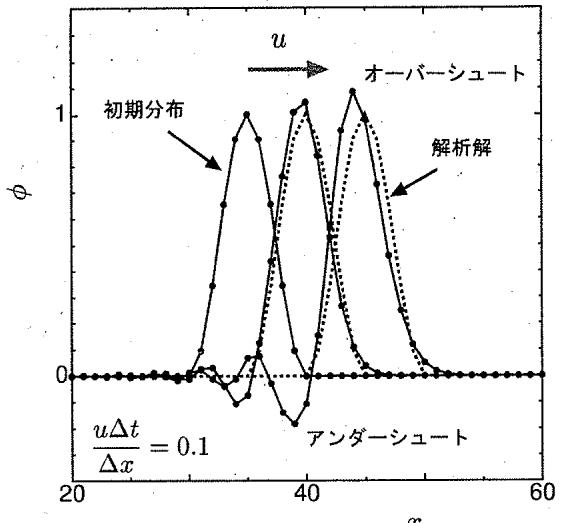  
図2.1:クーラン数が0.1の中心差分による移流方程式の数值解 $( u = 1 , \ \Delta x = 1 , \ \Delta t = 0 . 1 )$ この場合， $x - \sin = i \pi - r$ $x \times x = \pm \sqrt { x - 1 }$ が見られる.

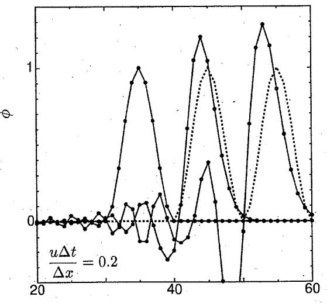  
図2.2:クーラン数が0.2の中心差分による移流方程式の数値解 $( u \doteq 1 , \Delta x = 1 , \Delta t = 0 . 2 )$ この場合，数値解析が不安定にな $2 \tau \cup 2 \pi$

## 第3章

## 拡散方程式の数値シミュレーション

## 3.1 拡散方程式

拡散方程式は，運動量分布に対する粘性の効果，熱や粒子分布の拡散などの非定常現象を表現する.時間微分と2階の空間微分を含んだ楕円型偏微分方程式であり，簡単な1次元では次のような形になっている.

$$
\frac { \partial \phi } { \partial t } = \lambda \frac { \partial ^ { 2 } \phi } { \partial x ^ { 2 } }\tag{3.1}
$$

このとき，入を一般的に拡散係数という。

拡散現象の特徴から予想されるように，移流方程式に比べて，拡散方程式では数値的な振動や発散の心配は少ない。また，数値計算の手続きは単純であり，安定計算のために気を遣うことが少ない。

## 3.2 離散化

単純な状況を想定して，1次元の拡散方程式(3.1)を数値シミュレーションで解く方法を考える．微分方程式の空間微分を中心差分で近似して，時間微分を陽的オイラー法で離散化する．nステップ目から次時間のn±1ステップ目の物理量を求める式は，次のようになる.

$$
\cdot \phi _ { i } ^ { n + 1 } = \phi _ { i } ^ { n } + \Delta t \lambda \frac { \phi _ { i + 1 } ^ { n } - 2 \phi _ { i } ^ { n } + \phi _ { i - 1 } ^ { n } } { \Delta x ^ { 2 } }\tag{3.2}
$$

## 3.3 安定条件(拡散数)

拡散方程式の数値 $\yen 123,456$ における安定条件を考える. 差分方程式(3.2)に無次元数が含まれている。

$$
d = \frac { \lambda \Delta t } { \Delta x ^ { 2 } }\tag{3.3}
$$

これを「拡散数」という．数値解析上の安定性の条件は次のようになる.

$$
d < \frac { 1 } { 2 }\tag{3.4}
$$

したがって，数値シミュレーションを実行する際の時間刻み幅に対する条件は次のようになる.

$$
\Delta t < \frac { \Delta { \dot { x } } ^ { 2 } } { 2 \lambda }\tag{3.5}
$$

移流方程式におけるクーラン数のように，拡散方程式においても，時間刻み幅に対する制約があることになる．クーラン数と拡散数を比較すると，クーラン数は格子幅の1乗に依存して，拡散数は2乗に依存している。したがって，拡散数の方が格子幅を小さくすることに敏感であることがわかる.

例えば，壁に沿う流れを考える，壁から離れた領域では，流速が大きく，移流効果が顕著になり，移流方程式の安定性に影響するクーラン数に注目しなければならない。ただし，通常は，その領域では格子幅を大きく設定するので，クーラン数に関わる安定条件には都合が良い，逆に，壁の近くの領域では，速度変化が大きく，拡散効果が顕著になり，拡散方程式の安定性に影響する拡散数が重要になる.

微分方程式が移流項と拡散項からなっている場合，それぞれの効果を同時に考えた条件が微分方程式に対する安定条件になる．実問題の数値シミ $I V - \gamma \equiv V ( 0 , \pi )$ 微分方程式の安定条件を見積もる手順は複雑であり，厳密な条件を知ることは不可能である．したがって，通常の数値シミュレーションの手順では，簡単な評価でおおまかな安定条件を調べて，その値に安全係数をかけて時間刻み幅を決めることになる，ここでは，具体的な安定条件を求めることができなくても，時間刻み幅には，安定に数値シミュレーションを実行するための制約があることを知ることが重要である.

なお，時間進行で陰解法を使うと、数値安定性の問題がなくなり，どのような時間刻み幅でも安定になる、ただし、時間刻み幅をいくらでも大きくできるわけではなく，物理現象を正確に再現できるように設定しなければならない.

## この章のポイント

・非圧縮性流れの基礎方程式において，拡散方程式はどのような位置付けにあるか。

・拡散方程式の離散方程式はどのような形になるか.

・拡散方程式の数値解析における安定条件は何か。安定条件を満たさないとどうなるか.

メモ欄

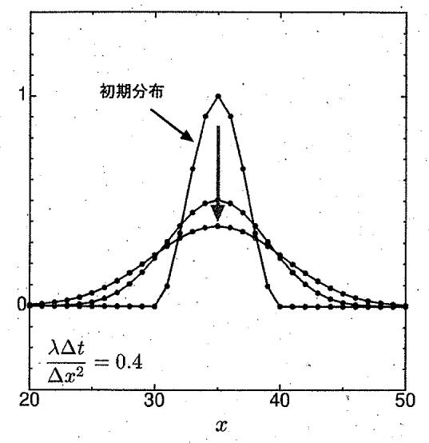  
図3.1：拡散数が0.4の中心差分による拡散方程式の数值解 $( \lambda = 1 , \ \Delta x = 1 , \ \Delta t = 0 . 4 )$ この場合，拡散現象の特徴が正常に再現されている。

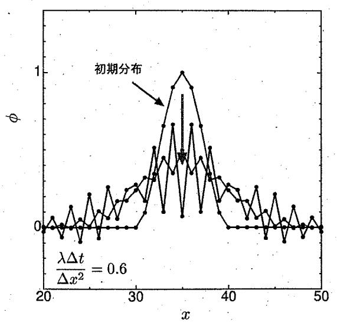  
図3.2:拡散数が0.6の中心差分による拡散方程式の数値解 $( \lambda = 1 , ~ \Delta x = 1 , ~ \Delta t = 0 . 6 )$ この場合，数値解析が不安定になって，非物理的な振動が発生している

## 第4章

# 移流方程式の数値シミュレーション（上流差分）

## 4.1 数值振動

ある物理量の初期分布が移流する場合を考える，このとき，時間発展する途中で，その物理量の値が，初期分布の最大値を越えることも，最小値を下回ることもないはずである：しかし，数値シミュレーションで差分計算を実行すると，たとえ時間進行計算の安定条件を満たしていても，非物理的な「オーバーシュート」や「アンダーシュート」が起こることがある．また，実際の物理現象とは無関係に，数値解析法の性質による高周波な変動が発達することがある。これを「数値振動」という.

例えば，質量やエネルギーが負になることがあってはならないし，キャビテーションの気相体積率は0から1の間になければならない。しかし，差分計算法の種類によっては，局所的な流れの状況から非物理的な値になってしまうことがある．そうなった瞬間に数値シミュレーションを継続することが不可能になる。あるいは，計算結果が無意味になる．数値シミュレーションの信頼性を維持するためには，数値計算上のこれらの現象をできる限り発生しないように注意しなければならない。

## 4.2 上流化，風上差分

移流方程式

$$
\frac { \partial \phi } { \partial t } = - u \frac { \partial \phi } { \partial x }\tag{4.1}
$$

を数値解析で解く例として，移流速度uが一定で，物理量の初期分布が孤立波の場合を考える．このときの厳密解は，初期分布の形状を維持したまま移流速度で移動していくことになる.

流速uの符号で判断された風上側の2点の物理量を使って，次のように離散化する.

$$
\phi _ { i } ^ { n + 1 } = \left\{ \begin{array} { l l } { \displaystyle { \phi _ { i } ^ { n } - \Delta t u \frac { \phi _ { i } ^ { n } - \phi _ { i - 1 } ^ { n } } { \Delta x } } } & { u \geq 0 } \\ { \displaystyle { \phi _ { i } ^ { n } - \Delta t u \frac { \phi _ { i + 1 } ^ { n } - \phi _ { i } ^ { n } } { \Delta x } } } & { u < 0 } \end{array} \right. .\tag{4.2}
$$

この計算方法を「風上差分」という。

中心差分の代わりに，風上差分を使って移流方程式を解くと，数値振動による非物理的なオーバー

シュートやアンダーシュートは発生しなくなる. $\downarrow \downarrow \downarrow$ ，元の微分方程式の数学的な厳密解とは異なり，時間進行とともに，物理量の初期の分布形状が維持されず，なまった分布になってしまう.

## 4.3 数值拡散

風上差分による数値 $\yen 123,456$ 結果がなまった理由を調べるために，移流項の風上差分に注目する、テーラー展開を使って位置iの値で書き直すと，次のようになる.

$$
\begin{array} { l } { \displaystyle - u \frac { \phi _ { i } ^ { n } - \phi _ { i - 1 } ^ { n } } { \Delta x } = - \frac { u } { \Delta x } \left\{ \phi _ { i } ^ { n } - \left( \phi _ { i } ^ { n } - \Delta x \left. \frac { \partial \phi } { \partial x } \right| _ { i } ^ { n } + \frac { \Delta x ^ { 2 } } { 2 } \left. \frac { \partial ^ { 2 } \phi } { \partial x ^ { 2 } } \right| _ { i } ^ { n } - \cdot \cdot \cdot \right) \right\} } \\ { \displaystyle \quad = - u \left. \frac { \partial \phi } { \partial x } \right| _ { i } ^ { n } + \frac { u \Delta x } { 2 } \left. \frac { \partial ^ { 2 } \phi } { \partial x ^ { 2 } } \right| _ { i } ^ { n } - \cdot \cdot \cdot } \end{array}\tag{4.3}
$$

右辺第2項以降の誤差項の最低次数は $\Delta x \phi$ 1次であるから，風上差分は1次精度である.この誤差項の中で主要な1次項は物理量 $\phi \phi 2$ 階の空間微分にな $2 7 6 2 5 0 5$ 物理的には拡散の効果を持 $0 \sum i$ る.このとき，拡散係数は

$$
\frac { u \Delta x } { 2 }\tag{4.4}
$$

である．この効果は，元の微分方程式には含まれておらず，風上差分による離散化によって加えられている。数値計算法に依存して導入された拡散効果であることから，これを「数値拡散」あるいは「人工拡散」 $y = \sum \limits _ { i = 1 } ^ { \infty } i$ また，流れの数値 $\vdots \downarrow 2 \downarrow - \downarrow \downarrow = \downarrow \uparrow 2$ ，実際の物理的な粘性とは別に「数値粘性」が働いていると言うこともある.

粘性流れの基礎方程式には，移流項と拡散項の両方が存在するが，移流項の離散化で数値拡散が発生すると，元の物理的な拡散項に対して数値拡散の分を過大に評価してしまう．レイノルズ数によって決められた移流項と拡散項の割合が変わる $S _ { \mathbf { \lambda } } \mathcal { D } _ { \mathbf { \lambda } } ^ { \mathbf { \vec { c } } } .$ 計算結果が物理的に異なることになる。

風上差分は，中心差分で発生した数値振動を防ぐことができたが，数値拡散という新たな問題を起こすことになる．計算結果に悪い影響がある場合には，信頼性のある計算結果を得るために，これら両方の数値解析上の問題を発生させない離散化方法を考えなければならない.

## 4.4QUICK法

移流方程式の時間進行計算で，格子の境界上の物理量 $\phi _ { i + 1 / 2 }$ を使って空間差分を求めると，次のようになる.

$$
\cdot \mathrm { ~  ~ \nabla ~ } \phi _ { i } ^ { n + 1 } = \phi _ { i } ^ { n } - \Delta t u \frac { \phi _ { i + 1 / 2 } ^ { n } - \phi _ { i - 1 / 2 } ^ { n } } { \Delta x }\tag{4.5}
$$

$$
= \phi _ { i } ^ { n } - \Delta t \frac { u \phi _ { i + 1 / 2 } ^ { n } - u \phi _ { i - 1 / 2 } ^ { n } } { \Delta x }\tag{4.6}
$$

下の式（4.6)は，物理量が計算格子の境界上を通過するフラックス(流束)の差し引きを計算していることになっている，このような式の形で精度良く計算できれば，局所的に物理量の保存性を維持できるので，保存しなければならない物理量に関係する物理現象の数値シ $\therefore \bot r - i \sin i$ を安定に実行できる。格子境界上の物理量の設定方法によって，これまでの計算方法を見直す。中心差分では，

$$
\stackrel { \cdot } { \phi _ { i + 1 / 2 } } = \frac { 1 } { 2 } \big ( \phi _ { i } + \phi _ { i + 1 } \big ) \stackrel { \cdot } { }\tag{4.7}
$$

となり，この場合には，計算結果に数値振動が発生していた。風上差分では，

$$
\stackrel { \cdot } { \phi _ { i + 1 / 2 } } = \left\{ \begin{array} { l l } { { \phi _ { i } } } & { { u \geq 0 } } \\ { { \phi _ { i + 1 } } } & { { u < 0 } } \end{array} \right.\tag{4.8}
$$

となり，数値振動はないが，数値拡散の影響があった.

これらに対して，格子境界上の物理量の選び方を考慮して，数値 $\yen 123,456$ 計算結果を改善する試みがある，境界の前後を挟んでいる2つの格子の値に加えて，さらに風上側のもう1つ隣の格子の値を用いることによ $b \tau$ 2次の多項式を構築 $L \dot { { \boldsymbol { \mathsf { C } } } }$ 格子の境界上の値を内挿する.

$$
\phi _ { i + 1 / 2 } = \left\{ \begin{array} { l l } { \frac { 1 } { 8 } ( - \phi _ { i ^ { \bot } 1 } + 6 \phi _ { i } + 3 \phi _ { i + 1 } ) { \mathrm { ~ . ~ } } u \geq 0 } \\ { { \mathrm { ~ . ~ } } } \\ { \frac { 1 } { 8 } ( 3 \phi _ { i } + 6 \phi _ { i + 1 } - \phi _ { i + 2 } ) { \mathrm { ~ . ~ } } u < 0 } \end{array} \right.\tag{4.9}
$$

ちなみに， $\Sigma \emptyset \Sigma$ 式は3次精度である．これを式(4.5)に代入すると，次の $\dot { \Sigma } \dot { \ }$ になる.

$$
\phi _ { i } ^ { n + 1 } = \left\{ \begin{array} { l l } { \phi _ { i } ^ { n } - \Delta t u \frac { 3 \phi _ { i + 1 } + 3 \phi _ { i } - 7 \phi _ { i - 1 } + \phi _ { i - 2 } } { 8 \Delta x } } & { u \geq 0 } \\ { \phi _ { i } ^ { n } - \Delta t u \frac { \phi _ { i + 2 } - 7 \phi _ { i + 1 } + 3 \phi _ { i } + 3 \phi _ { i - 1 } } { 8 \Delta x } . } & { u < 0 } \end{array} \right.\tag{4.10}
$$

この計算方法を[QUICK 法(Quadratic Upstream Interpolation for Convective Kinematics)」とう，結果的に，この計算式は2次精度にな $0 \tau v > \tau$ ，上の中心差分の精度と同じである．ただし，この計算式の2次の誤差項が中心差分より小さくなっているので，実際の計算結果の誤差は中心差分より小さいと期待できる。

これ以外にも，数値振動を防ぐための多くの改良が提案されている．これ以降では，使用実績が多い高精度な方法や特殊な状況で使用される方法を説明する.

## 4.5 その他の計算方法

## 4.5.1 河村・桑原スキーム

高次の計算方法の.1つに「河村・桑原による方法(河村・桑原スキーム)」がある.

$$
\phi _ { i } ^ { n + 1 } = \left\{ \begin{array} { l l } { \phi _ { i } ^ { n } - \Delta t u \frac { \phi _ { i + 2 } - 2 \phi _ { i + 1 } + 9 \phi _ { i } - 1 0 \phi _ { i - 1 } + 2 \phi _ { i - 2 } } { 6 \Delta x } } & { u \geq 0 } \\ { \phi _ { i } ^ { n } - \Delta t u \frac { - 2 \phi _ { i + 2 } + 1 0 \phi _ { i + 1 } - 9 \phi _ { i } + 2 \phi _ { i - 1 } - \phi _ { i - 2 } } { 6 \Delta x } } & { u < 0 } \end{array} \right.\tag{4.11}
$$

この方法は3次精度の風上差分にな $2 \tau _ { V } \tau _ { s }$ .小さなスケールの振動を抑えつつ，大きな変動を捉えることができるので，比較的粗い格子で乱流現象の数値 $\yen 123,456$ を実行できると言われている.

## 4.5.2 TVD スキーム

まずはじめに，TV(Total Variation)という指標を定義する.

$$
\displaystyle T V ^ { n } = \sum _ { j } \big | \phi _ { j + 1 } ^ { n } - \phi _ { j } ^ { n } \big | \operatorname { \partial } _ { . }\tag{4.12}
$$

このTVが時間進行にしたがって減少しなければならない.とする制限を「TVD条件(TotalVariationDiminishing)」という.具体的な状況でTVD条件を実現するために，移流方程式の数值 $\yen 123,456$ ションにおいて，数値振動が発生する場所では1次精度の風上差分を，それ以外の場所では高次精度の差分を適用する．すなわち，状況によって差分計算法を切り替える，このように，TVD条件に従う計算方法を「TVDスキーム」という.

移流方程式の差分式(4.6)の $\phi _ { i + 1 / 2 }$ を次の式で計算する.

$$
\phi _ { i + 1 / 2 } ^ { n } = \left\{ \begin{array} { l l } { \displaystyle \phi _ { i } ^ { n } + \frac { 1 } { 2 } \Psi _ { i - 1 / 2 } ^ { + } \big ( \phi _ { i } ^ { n } - \phi _ { i - 1 } ^ { n } \big ) } & { u \geq 0 } \\ { \displaystyle \phi _ { i + 1 } ^ { n } - \frac { 1 } { 2 } \Psi _ { i + 3 / 2 } ^ { - } \big ( \phi _ { i + 2 } ^ { n } - \phi _ { i + 1 } ^ { n } \big ) } & { u < 0 } \end{array} \right.\tag{4.13}
$$

この中のΨは，φの分布によって値を変えるリミッターである．リミッターにはいろいろな選び方があるが。例えば，代表的なものとしては，minmod関数を使用した次の式がある.

$$
\Psi _ { i - 1 / 2 } ^ { + } = \mathrm { m i n m o d } \left( 1 , \frac { \phi _ { i + 1 } ^ { n } - \phi _ { i } ^ { n } } { \phi _ { i } ^ { n } - \phi _ { i - 1 } ^ { n } } \right)\tag{4.14}
$$

$$
\Psi _ { i + 3 / 2 } ^ { - } = \mathrm { m i n m o d } \left( 1 , \frac { \phi _ { i + 1 } ^ { n } - \phi _ { i } ^ { n } } { \phi _ { i + 2 } ^ { n } - \phi _ { i + 1 } ^ { n } } \right)\tag{4.15}
$$

このときのminmod関数は次のようにな $0 \sum t ^ { 2 }$ る.

$$
\mathrm { m i n m o d } ( 1 , r ) _ { . } = \left\{ \begin{array} { l l } { 1 } & { 1 \leq r } \\ { ~ } \\ { r } & { 0 \leq r < 1 } \\ { ~ } \\ { 0 } & { r < 0 } \end{array} \right.\tag{4.16}
$$

物理量の分布の状況によって，計算方法が自動的に変わるようになっている．具体的には，1≤rの場合には，物理量 $\phi ^ { \mathrm { ~ \small ~  ~ } }$ 勾配が下流方向に増加しており，2次の風上差分を適用する. $0 \leq r < 1$ の場合には，φの勾配が下流方向に減少しており，2次の中心差分を適用する. $r < 0 ~ \mathcal { O }$ 場合には，φの勾配の正負が変わっており，1次の風上差分を適用する．この計算方法は，非圧縮性流れではなく，主に圧縮性流れの数値シ $\beta \ I \ V - \gamma \equiv \gamma \pi$ 使用されている．その中で，物理量が不連続になる衝撃波を精度良く捉え $z = 2 z = 7$ きる.

## 4.5.3 CIP 法

CIP(Cubic-Interpolated Pseudoparticle)法では，元の移流方程式に加えて，物理量の空間1階微分が変数の微分方程式を同時に解く

$$
\frac { \partial \phi } { \partial t } = - u \frac { \partial \phi } { \partial x }\tag{4.17}
$$

$$
\frac { \partial } { \partial t } \left( \frac { \partial \phi } { \partial x } \right) = - u \frac { \partial } { \partial x } \left( \frac { \partial \phi } { \partial x } \right)\tag{4.18}
$$

$\sum = I - l$ は，移流速度が正(u>0)のときを考える．例えば，物理量 $\phi$ の分布を，位置i(x=0)とその上流の位置 $i - \mathbb { 1 } \left( x = - \Delta x \right)$ の情報を使って，3次多項式で近似すると，次のようになる.

$$
\phi ( x ) = \phi _ { i } + \left( \frac { \partial \phi } { \partial x } \right) _ { i } x + \left\{ \frac { 2 \left( \frac { \partial \phi } { \partial x } \right) _ { i } + \left( \frac { \partial \phi } { \partial x } \right) _ { i - 1 } } { \Delta x } - 3 \frac { \phi _ { i } - \phi _ { i - 1 } } { \Delta x ^ { 2 } } \right\} x ^ { 2 } + \left\{ \frac { \left( \frac { \partial \phi } { \partial x } \right) _ { i } + \left( \frac { \partial \phi } { \partial x } \right) _ { i - 1 } } { \Delta x ^ { 2 } } - 2 \frac { \phi _ { i } - \phi _ { i - 1 } } { \Delta x ^ { 3 } } \right\} x ^ { 3 }\tag{4.19}
$$

この近似式を移流方程式(4.17)と式(4.18)に代入すると，差分式は次のようになる.

$$
\phi _ { i } ^ { \dot { n } + 1 } = \phi _ { i } ^ { n } - \Delta t u \left( \frac { \partial \phi } { \partial x } \right) _ { i } ^ { n }\tag{4.20}
$$

$$
\left( \frac { \partial \phi } { \partial x } \right) _ { i } ^ { n + 1 } = \left( \frac { \partial \phi } { \partial x } \right) _ { i } ^ { n } - \Delta t u 2 \left\{ \frac { 2 \left( \frac { \partial \phi } { \partial x } \right) _ { i } + \left( \frac { \partial \phi } { \partial x } \right) _ { i - 1 } } { \Delta x } - 3 \frac { \phi _ { i } - \phi _ { i - 1 } } { \Delta x ^ { 2 } } \right\}\tag{4.21}
$$

この方法は，物理量とその空間1階微分を変数としているので，2点の情報だけで3次精度を表現できる．すなわち，ある点の時間進行計算が，その付近の少ない格子点だけで済むことになる．ただし，プ

ログラミングのときに，通常より多くの変数を処理しなければならないので，計算負荷が大きくなる。また，上の計算式を移流方程式（4.6)と等価な形に変形できないので，保存性を保証できないことが欠点であると言われている.

## この章のポイント

• 数値振動とは何か.

• 風上差分とは何か.

数値拡散，数值粘性とは何か.

-メモ欄-

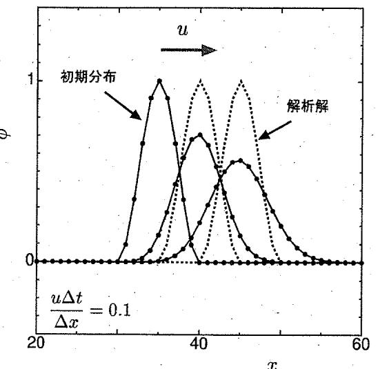  
図4.1:風上差分による移流方程式の数值解 $( u = 1 , ~ \Delta x = 1 , ~ \Delta t = 0 . 1 )$ $5 - x - y = - 1$ ，アンダーシュートはないが，数値拡散が起こっている.

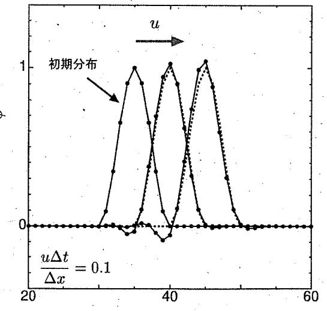

$$
( u = 1 , ~ \Delta x = 1 , ~ \Delta t = 0 . 1 )
$$

$$
7 ^ { 2 } \times 7 ^ { 3 } - 2 = 1
$$

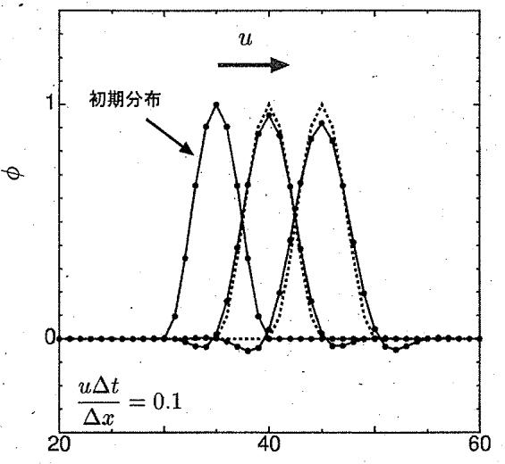

図4.3:河村・桑原スキームによる移流方程式の数値解 $( u = 1 , ~ \Delta x = 1 , ~ \Delta t = 0 . 1 )$ この場合， $7 \times 7 = 2 2$ トが改善している.

## 第5章

# 非圧縮性流れの数値解析法（MAC系解法）

## 5.1 非圧縮性流れ数値解析法の概要

非定常な非圧縮性流れの基礎方程式には，双曲型，放物型，楕円型微分方程式の性質が含まれている.このような複合的な微分方程式を，数値解析の技術を駆使して，計算格子上で解く手順を考える.Harlowら(米国，1965年)によってMAC(Marker and Cell)法が開発された. MAC法では，主に自由表面を捕らえることを目的として，格子中に仮想点（Marker）を配置し，流れに乗せて移動させる.それと同時に，格子（Cell)を用いた非圧縮性流れの計算アルゴリズムも示されている．格子で囲まれた領域に対する物理量の流入をセル境界で計算するために，流速を格子境界に配置して，圧力やその他のスカラー量を格子中心に配置するスタッガード格子(StaggeredGrid)が用いられた。このように，現在，広く利用されている格子を用いた数値解析法は，MAC法の提案の一部として登場した.その後，格子を用いた非圧縮性流れの数値解析法の部分だけに注目して改良されたSMAC(SimplifiedMAC）法やHSMAC(HighlySimplifiedMAC)法，Fractional Step法などが提案されている.また，これに関連する方法として，圧縮性流れと非圧縮性流れを統一的に解析できるICE（ImplicitContinuous-fluidEulerian）法，移動や変形する物体周りの流れを解析するALE（Arbitrary Lagrangian-Eulerian）法，気液混相流れを解析するVOF(Volumeof Fluid)法などがあり，MAC系解法として各方面に発展していった.

また異なる系統として，SIMPLE法(Semi-Implicit Method for Pressure-Linked Equation)が英国で提案された，当初は，定常流れを想定して開発されたが，現在では，非定常流れを解析対象にする研究例もある.MAC法と同様に，スタッガード格子を用いて，物理量の数値的な振動を抑えている.

## 5.2 非圧縮性流れ数値解析のための計算格子

非圧縮性流れの数値解析を安定に実行するために，本来，MAC法およびSIMPLE法はスタッガード格子を用いる．スタッガード格子とは，計算変数である速度（流速ベクトル）の各方向成分を格子の境界上に，圧力を格子の中心点に配置する計算格子である。したがって，速度成分と圧力の定義点は一致しておらず，結果的に格子半分ずっズレている：また，流れ場の状況によって付随的に計算する必要があるスカラー値は，圧力と同じように格子中心に配置されることが多い.

スタッガード格子以外の計算格子として，速度全成分と圧力を格子の中心に定義するレギュラー格子(RegularGrid)がある，すべての変数を同一点で定義するので，直感的で理解しやすく，計算手順が単純になると考えられる.しかし，レギュラー格子では流れの数値解析を安定に実行できない場合が多く，実質的にレギュラー格子が用いられる例はほとんどない。

流れの数値解析で，レギュラー格子ではなく，スタッガード格子を用いる利点として，物理量の保存性と計算の安定性がある。一般的なスカラー量の移流項を計算する際に，格子境界を通して格子の内外に流入流出する流束を直接的に評価できるので，保存性を保証しなければならないスカラ一量を精度良く計算できる，また，速度や圧力の差分を計算するときに発生する可能性のある数値振動を抑えることができる.

レギュラー格子の問題点を考える．速度の各成分の位置で圧力項を見積もるために圧力勾配を計算する必要がある，ある計算格子の中心で圧力勾配を差分で計算するときには，勾配を考えている方向の両隣の格子中心の圧力を参照する。このように1格子分離れたデータから求められた圧力勾配が連続分布になるための制約を考えると，1格子毎に自由度を有することになる．すなわち，1格子飛びの圧力の値を同時に変化させても圧力勾配は変化せず，結局，圧力分布に1格子每の振動が発生しても，基礎方程式の圧力勾配には影響が表れないことになる，また同様に，速度成分分布に1格子毎の振動が発生しても，速度勾配は変化せず，連続の式が満たされたままになる。ただし，粘性項を見積もるときに，この速度成分の振動の影響が陽に表れるので，結果的に，粘性の影響で振動が抑えられることになる。しかし，これは基礎方程式が記述している流れ場の本来の性質とは異なる.以上のことから，流れの数値解析が正常に実行されているように見えるときでも，実際には，圧力分布や速度分布に非物理的な振動が発生して，解析結果は見るに値しないことになる.

レギュラー格子には，差分計算に起因する圧力や速度成分の振動を許容する性質があるが，スタッガード格子を用いると，このような計算格子毎の振動を本質的に防ぐことができ，計算結果は連続で滑らかな分布になる。

## 5.3 SMAC法による時間進行計算

ここでは，MAC法を元に改良された方法の中から，SMAC法を説明する.

いま，2次元の非圧縮性流れを考えると，基礎方程式は次のような連続の式とNavier-Stokes方程式になる.

$$
\frac { \partial u } { \partial x } + \frac { \partial v } { \partial y } = 0\tag{5.1}
$$

$$
\frac { \partial u } { \partial t } = - u \frac { \partial u } { \partial x } - v \frac { \partial u } { \partial y } - \frac { \partial p } { \partial x } + \nu \left( { \frac { \partial ^ { 2 } u } { \partial x ^ { 2 } } + \frac { \partial ^ { 2 } u } { \partial y ^ { 2 } } } \right)\tag{5.2}
$$

$$
\frac { \partial v } { \partial t } = - u \frac { \partial v } { \partial x } - v \frac { \partial v } { \partial y } - \frac { \partial p } { \partial y } + \nu \left( \frac { \partial ^ { 2 } v } { \partial x ^ { 2 } } + \frac { \partial ^ { 2 } v } { \partial y ^ { 2 } } \right) .\tag{5.3}
$$

時間進行計算を実行するときに，基礎方程式である連続の式とNavier-Stokes方程式の圧力項を後退 Euler 法な $\yen 7$ 陰的に計算して，これら以外の項を前進Euler法（あるいは，Adams-Bashforth法，Runge-Kutta法など)で陽的に計算する.時間積分のための離散化を具体的に書くと次のようになる.

$$
{ \frac { \partial u ^ { n + 1 } } { \partial x \ . } } + { \frac { \partial v ^ { n + 1 } } { \partial y } } = 0\tag{5.4}
$$

$$
u ^ { n + 1 } = u ^ { n } + \Delta t \left\{ - u ^ { n } \frac { \partial u ^ { n } } { \partial x } - v ^ { n } \frac { \partial u ^ { n } } { \partial y } - \frac { \partial p ^ { n + 1 } } { \partial x } + \nu \left( \frac { \partial ^ { 2 } u ^ { n } } { \partial x ^ { 2 } } + \frac { \partial ^ { 2 } u ^ { n } } { \partial y ^ { 2 } } \right) \right\}\tag{5.5}
$$

$$
{ v ^ { n + 1 } } ^ { * } = { v ^ { n } } + \Delta t \left\{ - { u ^ { n } } { \frac { \partial { v ^ { n } } } { \partial x } } - { v ^ { n } } { \frac { \partial { v ^ { n } } ^ { * } } { \partial y } } - { \frac { \partial { p ^ { n + 1 } } ^ { * } } { \partial y } } + { u } ^ { * } \left( { \frac { \partial ^ { 2 } { v ^ { n } } } { \partial x ^ { 2 } } } + { \frac { \partial ^ { 2 } { v ^ { n } } } { \partial y ^ { 2 } } } \right) \right\}\tag{5.6}
$$

ある時刻nに基礎方程式に含まれるすべての物理量が既知であると ${ \mathfrak { L } } \tau .$ SMAC法によって次の時刻 $n + 1 \emptyset )$ 物理量を求める手順は以下 $\textcircled{0}$ 通りである.

まず第1段階で，Navier-Stokes方程式を陽的に時間積分する.

$$
u ^ { * } = u ^ { n } + \Delta t \left\{ - u ^ { n } \frac { \partial u ^ { n } } { \partial x } - v ^ { n } \frac { \partial u ^ { n } } { \partial y } - \frac { \partial p ^ { n } } { \partial x } + \nu \left( \frac { \partial ^ { 2 } u ^ { n } } { \partial x ^ { 2 } } + \frac { \partial ^ { 2 } u ^ { n } } { \partial y ^ { 2 } } \right) \right\} .\tag{5.7}
$$

$$
v ^ { * } = v ^ { n } + \Delta t \left\{ - u ^ { n } { \frac { \partial v ^ { n } } { \partial x } } - v ^ { n } { \frac { \partial { \dot { v } } ^ { n } } { \partial y } } - { \frac { \partial p ^ { n } } { \partial y } } + \nu \left( { \frac { \partial ^ { 2 } v ^ { n } } { \partial x ^ { 2 } } } + { \frac { \partial ^ { 2 } v ^ { n } } { \partial y ^ { 2 } } } \right) \right\}\tag{5.8}
$$

ここで求まる速度成分は， $\therefore \frac { 1 } { 9 } = \frac { 1 } { 9 }$ も連続 $\dot { \cdot } \mathcal { O }$ 式 (5.4) を満たすとは限らな $\zeta = \phi \tau ,$ 正式な次時間の速度成分 $\cdot u ^ { n + 1 } , \dot { v } ^ { n + 1 }$ ではなく，計算途中の一時的な速度成分として $u ^ { * } , v ^ { * }$ と表示 $L \tau _ { } ( \tau _ { } )$

次に，第2段階の準備として，式(5.5)(5.6)から式(5.7)(5.8)を引くと，次のようになる.

$$
u ^ { n + 1 } = \stackrel { \cdot } { u ^ { * } } - \Delta t \frac { \partial p ^ { n + 1 } - p ^ { n } } { \partial x } = u ^ { * } - \Delta t \frac { \partial \Delta p } { \partial x }\tag{5.9}
$$

$$
v ^ { n + 1 } = v ^ { * } \cdot \Delta t \frac { \partial p ^ { n + 1 } - p ^ { n } } { \partial \dot { y } } = v ^ { * } - \Delta t \frac { \partial \Delta p } { \partial y }\tag{5.10}
$$

ただし,

$$
\Delta p \stackrel { . . } { = } p ^ { n + 1 } - \stackrel { . } { p } ^ { n }\tag{5.11}
$$

である. 式(5.9)(5.10)を連続の式 (5.4)に代入すると，次の式が得られる.

$$
\cdot \frac { \partial ^ { 2 } \Delta \dot { p } } { \partial x ^ { 2 } } + \frac { \partial ^ { 2 } \Delta \dot { p } } { \partial y ^ { 2 } } = \frac { 1 } { \Delta t } \left( \cdot \frac { \partial u ^ { * } } { \partial x } + \frac { \partial v ^ { * } } { \partial y } \right)\tag{5.12}
$$

これは，圧力変化 $\Delta p$ に対するPoisson方程式である.第1段階で計算された速度成分 $u ^ { * } , v ^ { * }$ を使って，この方程式を解くと，圧力変化 $\Delta p$ が得られる. これを式(5.9)(5.10)に代入すると，次時間の速度成分 $u ^ { n + 1 } , v ^ { n + 1 }$ が求まる．また，式(5.11)に代入すると，次時間の圧力 $p ^ { n + 1 }$ が求まる。以上で，SMAC法による時間進行計算 $\begin{array} { r } { \varpi \mathbb { 1 } \times \breve { \tau } \stackrel { \cdot } { \ y } \colon } \end{array}$ プが完了する，この手順を繰り返しながら，連続の式を満たす速度成分と圧力分布を計算することになる。

元の非圧縮性流れの基礎方程式には，双曲型，放物型，楕円型の微分方程式の特性が含まれている.SMAC法では，これらをうまく分離 $L ^ { i , \phantom { i , } }$ 双曲型と放物型に対応する部分を第1段階で陽的に計算して，楕円型に対応す $3$ 部分を第2段階で陰的に計算する

第1段階では，陽的な計算手段から成っているので，具体的な計算作業は比較的簡単である。ただし対流項と粘性項の時間進行計算に関係する安定性を保証するために，安定条件に注意しなければならない：そのために，例えば，時間刻みΔtを調整しなければならない．第2段階では，Poisson方程式を解くために，大きな行列計算を実行しなければならない，通常は，直接解法ではなく，SOR法のような反復法を使用する。それでも，計算時間が長くなるので，効率良くPoisson方程式を解けるように，数値解析法をできる限り改良する必要がある。

## 5.4 SMAC法における空間離散化

時間進行計算の途中で必要になる物理量の空間微分は，スタッガード格子上に離散的に定義された物理量から差分によって計算することになる，各項の差分による空間離散化の方法を説明する.

第1段階で計算する式(5.7)は，速度成分が定義されている格子境界上 $( i + 1 / 2 , j )$ で成り立ってい$z _ { \mathcal { O } , \mathcal { C } , }$ 右辺の各項も格子境界上の値を求めなければならない。

対流項の空間差分計算は次のようになる。

$$
- u ^ { n } \frac { \partial u ^ { n } } { \partial x } \bigg | _ { i + 1 / 2 , j } - v ^ { n } \frac { \partial u ^ { n } } { \partial y } \bigg | _ { i + 1 / 2 , j } - = - u _ { i + 1 / 2 , j } ^ { n } \frac { u _ { i + 1 , j } ^ { n } - u _ { i , j } ^ { n } } { \Delta x } - \dot { v } _ { i + 1 / 2 , j } ^ { n } \frac { u _ { i + 1 / 2 , j + 1 / 2 } ^ { n } - u _ { i + 1 / 2 , j - 1 / 2 } ^ { n } } { \Delta y }\tag{5.13}
$$

この中で，

$$
u _ { i + 1 , j } ^ { n } ~ , ~ u _ { i , j } ^ { n } ~ , ~ v _ { i + 1 / 2 , j } ^ { n } ~ , ~ u _ { i + 1 / 2 , j + 1 / 2 } ^ { n } ~ , ~ u _ { i + 1 / 2 , j - 1 / 2 } ^ { n }\tag{5.14}
$$

は，本来の定義点から外れているので，この時点で不明であ ${ \mathfrak { h } } ,$ 必要に応じて補間計算で算出すること

になる.

$$
\begin{array} { r l } & {  \qquad - u ^ { n } \frac { \partial u ^ { n } } { \partial x } | _ { i + 1 / 2 ; j } - v ^ { n } \frac { \partial u ^ { n } } { \partial y } | _ { i + 1 / 2 ; j } = } \\ & {  \qquad \cdot \qquad \frac { u _ { i + 3 / 2 , j } ^ { n } } { 2 } + u _ { i + 1 / 2 , j } ^ { n } - \frac { u _ { i + 1 / 2 , j } } { 2 } - \frac { \omega _ { i + 1 / 2 , j } } { 2 } \} } \\ & { \qquad - u _ { i + 1 / 2 , j } ^ { n } \frac { \partial u _ { i + 3 / 2 , j } ^ { n } } { 2 } \frac { \partial u _ { i + 1 / 2 , j } ^ { n } } { \partial x } \frac { u _ { i + 1 / 2 , j } ^ { n } } { \partial y } \qquad \cdot \qquad \cdot \qquad \cdots \qquad \cdots } \\ & { \qquad \cdot \qquad \cdots } \\ & { \qquad \cdot \qquad \frac { v _ { i + 1 , j + 1 / 2 } ^ { n } + v _ { i , j + 1 / 2 } ^ { n } + v _ { i + 1 , j - 1 / 2 } ^ { n } + v _ { i , j - 1 / 2 } ^ { n } } { 2 } \frac { u _ { i + 1 / 2 , j + 1 } ^ { n } + u _ { i + 1 / 2 , j } ^ { n } } { 2 } - \frac { u _ { i + 1 / 2 , j } ^ { n } + u _ { i + 1 / 2 , j - 1 } } { 2 } } \end{array}\tag{5.15}
$$

ところで，対流項の離散化方法は唯一ではなく，微分の差分化と補間計算の順番を換えることによって，異なる離散化が導出される。上の離散化は直感的であるが，これ以外にも，例えば，

$$
\begin{array} { l }  {  \begin{array} { l } { { \displaystyle - u ^ { n } \frac { \partial u ^ { n } } { \partial x } | _ { i + 1 / 2 , j } - v ^ { n } \frac { \partial u ^ { n } } { \partial y } | _ { i + 1 / 2 , j } = } } \\ { { \displaystyle - ( \frac { u _ { i + 1 / 2 , j } ^ { n } + u _ { i - 1 / 2 , j } ^ { n } } { 2 } \frac { u _ { i + 1 / 2 , j } ^ { n } } { \Delta x } - u _ { i - 1 / 2 , j } + \frac { u _ { i + 3 / 2 , j } ^ { n } } { 2 } \frac { u _ { i + 3 / 2 , j } ^ { n } } { 2 } \frac { u _ { i + 3 / 2 , j } ^ { n } - u _ { i + 1 / 2 , j } ^ { \prime } } { \Delta x } ) / 2 } \end{array}  } } \\    \begin{array} { l } { { \begin{array} { l } { { \begin{array} { l } { { \begin{array} { l } { { \begin{array} { l } { \\\ { \Lambda _ { i + 1 , j + 1 / 2 } + 9 } \frac { } { \Lambda _ { i , j + 1 / 2 } } } { 2 } \frac { \partial u _ { i + 1 / 2 , j + 1 } ^ { n } } { \partial y } } \frac { u _ { i + 1 / 2 , j + 1 } ^ { n } - u _ { i + 1 / 2 , j } } { \Delta y } } { \Delta z } } \end{array} } - \frac { u _ { i + 1 , j - 1 / 2 } ^ { n } + u _ { i , j - 1 / 2 } } { 2 } \frac { u _ { i + 1 , j - 1 / 2 } ^ { n } } { 4 } \frac { u _ { i + 1 / 2 , j } ^ { n } - u _ { i + 1 / 2 , j - 1 } ^ { \prime } } { \Delta y } } \end{array} } ) / 2 } } \\    \begin{array} { l }   \begin{array} { l }   \begin{array} { l }   \begin{array} { l }   \begin{array} { l }  \begin{array} { l }  \begin{array} { l }  \begin{array} { c }  \begin{array} { c }  \begin{array} { c } { \begin{ c } } { \end{array} } \Lambda _  \end{array} \end{array} \end{array} \end{array} \end{array} \end{array} \end{array} \end{array} \end{array} \end{array} \end{array} \end{array} \end{array}\tag{5.16}
$$

のように計算す $3 \leq 2 8$ 可能である．実は，後者の離散化のほうがエネルギーの保存特性が優れていて，安定に時間進行計算を実行できることが証明さ $\frac { 1 } { 4 } \pi \times 4 = 3$

このように中心差分と補間の順番に注意して計算を実行すると，時間進行計算の安定性を改善できるが，それでも流れ場の状況により安定にならない場合は，先に示した風上差分などを採用して，適当な数値粘性を導入することが必要になる。

粘性項も，対流項と同様に，差分計算を実行する、その際にも，定義点とは異なる位置の速度成分は，定義点から補間計算に $\pounds _ { \cdot } >$ て求めることになる。

圧力勾配項の差分計算は，単純であり，

$$
\cdot - \left. \frac { \partial p ^ { n } } { \partial x } \right| _ { i + 1 / 2 , j } = - \frac { p _ { i + 1 } ^ { n } - p _ { i } ^ { n } } { \Delta x }\tag{5.17}
$$

となる.

連続の式は，格子中心点(i;j)で成り立っているので，格子境界上で定義されている速度成分を使っ

て，次のように単純な形になる.

$$
\frac { u _ { i + 1 / 2 , j } ^ { n + 1 } - u _ { i - 1 / 2 , j } ^ { n + 1 } } { \Delta x } + \frac { v _ { i , j + 1 / 2 } ^ { n + 1 } - \dot { v } _ { i , j - 1 / 2 } ^ { n + 1 } } { \Delta y } = 0\tag{5.18}
$$

この差分式に圧力勾配項を組み合せると，離散化された圧力変化 $\Delta p ^ { \circ }$ Poisson方程式が得られる.

$$
\frac { \Delta p _ { i + 1 , j } - 2 \Delta p _ { i , j } + \Delta p _ { i - 1 , j } } { \Delta x ^ { 2 } } + \frac { \Delta p _ { i , j + 1 , \mathrm { ~ - ~ } } 2 \Delta p _ { i , j } } { \Delta y ^ { 2 } } + \Delta p _ { i , j } - \frac { 2 \Delta p _ { i , j } } { \Delta t } + \Delta p _ { i , j - 1 }  { \Delta x } = \frac { - 1 } { \Delta t } \left( \frac { u _ { i + 1 / 2 , j } ^ { \ast } - u _ { i - 1 / 2 , j } ^ { \ast } } { \Delta x } + \frac { v _ { i , j + 1 / 2 } ^ { \ast } - v _ { i , j - 1 / 2 } ^ { \ast } } { \Delta y } \right)\tag{5.19}
$$

## 5.5 SMAC 法における境界条件

流れの基礎方程式を解くためには，境界条件が必要である，具体的には，流れ場の状況に応じて，速度成分と圧力に対する境界条件を設定することになる.

固体壁上であれ $l i , i i ,$ 速度成分をゼロに固定する(Non-Slip条件).

$$
u = 0 ; ~ v = 0\tag{5.20}
$$

一定の速度分布で計算領域に流入する場合には，その速度分布に固定する。このようにある値に固定する境界条件をディリクレ境界条件(Dirichlet BoundaryCondition)という.

速度が空間的に変化しないような境界や流れ場が対称になっている対称境界では，速度勾配をゼ口に設定する(Free Slip 条件).

$$
\frac { \partial u } { \partial x } { = } 0\tag{5.21}
$$

このように勾配を固定する境界条件をノイマン境界条件(NeumannBoundaryCondition)という.SMAC法で時間進行計算を実行する場合には，その第2段階における次時間の速度成分を求める計算式(5.9)(5.10)で，境界条件によって決められる値になるように，圧力勾配を設定する．すなわち,

$$
\frac { \partial \Delta p } { \partial x } = \frac { 1 } { \Delta t } ( u ^ { \ast } - u ^ { n + 1 } )\tag{5.22}
$$

$$
\frac { \partial \Delta p } { \partial y } = \frac { 1 } { \Delta t } ( v ^ { \dot { * } } - v ^ { n + 1 } )\tag{5.23}
$$

というノイマン条件を圧力変化 $\Delta p$ に対するPoisson方程式の境界条件とすることになる.あるいは，第1段階が終了した時点で，一時的な速度成分 $u ^ { * } , v ^ { * } \oslash$ 境界上の値を境界条件によって決められる値に設定して，第2段階の次時間の速度成分を求める計算式(5.9)(5.10)で，境界上の速度成分を変更しな

いように，圧力変化 $\Delta p$ の勾配をゼロにする。

$$
{ \frac { \partial \Delta p } { \partial x } } = 0 \ .\tag{5.24}
$$

$$
{ \frac { \partial \Delta p } { \partial y } } = 0\tag{5.25}
$$

いずれにしても，壁上のように速度成分に対してディリクレ境界条件を設定する場合には，圧力変化に対するPoisson方程式にノイマン境界条件を設定す $z = z \pi + z$ る。ノイマン境界条件を組み合わせると，Poisson方程式の数値解析は困難になるので，残念ながら望ましくない状況である。

## 5.6 Fractional Step 法による時間進行計算

前章までに説明したSMAC法と類似している時間進行法として，Fractional Step法（部分段階法ともいう）がある。この方法では，粘性項を陰的に扱うなどの改良を考慮しつつ，第1段階の一時的な速度を求める計算式(5.7)(5.8)の代わりに，対流項と粘性項だけの次の式を使用する.

$$
u ^ { * } = u ^ { n } + \dot { \Delta t } \left\{ - u ^ { n } \frac { \partial u ^ { n } } { \partial x } - v ^ { n } \frac { \partial u ^ { n } } { \partial y } + \nu \left( \frac { \partial ^ { 2 } u ^ { n } } { \partial x ^ { 2 } } + . . \frac { \partial ^ { 2 } u ^ { n } } { \partial y ^ { 2 } } \right) \right\}\tag{5.26}
$$

$$
v ^ { * } = v ^ { n } + \Delta t \left\{ - u ^ { n } \frac { \partial v ^ { n } } { \partial x } - v ^ { n } \frac { \partial v ^ { n } } { \partial y } + \nu \left( \frac { \partial ^ { 2 } v ^ { n } } { \partial x ^ { 2 } } + \frac { \partial ^ { 2 } v ^ { n } } { \partial y ^ { 2 } } \right) \right\}\tag{5.27}
$$

$c \subset { \mathsf { T } }$ は，粘性項は陽的 $\textdegree$ ままで示している．このときの ${ \boldsymbol { u } } ^ { * } , { \boldsymbol { v } } ^ { * }$ には圧力勾配の影響が含まれていない${ \mathcal { O } } { \overline { { \mathbb { C } } } } ,$ 速度成分として見ることができないが， $c \subset \mathbb { C }$ は部分段階速度という.

この変更の結果として，第2段階の圧力のPoisson方程式は，

$$
\frac { \partial ^ { 2 } p ^ { n + 1 } } { \partial { x } ^ { 2 } } + \frac { \partial ^ { 2 } p ^ { n + 1 } } { \partial { y } ^ { 2 } } = \frac { 1 } { \Delta t } \left( \frac { \partial { u } ^ { * } } { \partial x } + \frac { \partial { v } ^ { * } } { \partial y } \right) .\tag{5.28}
$$

となり， $\subset \mathcal { O }$ 方程式を解くと，次時間の圧力 $p ^ { n + 1 }$ が求まる. $\subset \mathcal { O }$ 計算方法では，SMAC法とは異なり，Poisson方程式を解く際に，圧力 $p ^ { \dot { } }$ に関する境界条件を指定できる。また，次時間の速度成分$u ^ { n + 1 } , v ^ { n + 1 } .$ は，

$$
u ^ { n + 1 } = u ^ { \dot { * } } - \dot { \Delta t } \frac { \partial p ^ { n + 1 } } { \partial x } .\tag{5.29}
$$

$$
v ^ { n + 1 } = v ^ { * } - \Delta t \frac { \partial p ^ { n + 1 } } { \partial y }\tag{5.30}
$$

で求まる

時間進行計算の手順が異なるだけであり，スタッガード格子を用いた空間微分の離散化方法や境界条件に関係する計算は，SMAC法の場合と同じである.また，SMAC法と同様に，時間進行計算を安定に実行するために，対流項の離散化に注意しなければならない。

## この章のポイント

・MAC系解法にはどのような数値解析法があるか

・ SMAC法はどのような手順で計算する方法か.

SMAC 法とFractional Step 法の違いは何か.

★ICE法，ALE法，VOF法のそれぞれの目的と特徴は何か

メモ欄-

## 第6章

## 非圧縮性流れの数値解析法（SIMPLE系解法）

## 6.1 SIMPLE法による（時間進行）計算

非圧縮性流れの基礎方程式である流速べクトルと圧力に関する連立微分方程式を解く方法として，MAC系解法以外に，SIMPLE法(Semi-Implicit Method for Pressure-Linked Equation)がある.ただし，SIMPLE法は，MAC系解法とは異なり，もともと定常流れの基礎方程式を解くために開発された解析方法である.その後，SIMPLER(SIMPLE Revised)法，SIMPLEC(SIMPLE Consistent)法という改良版が提案されている．さらに，時間発展のための反復計算を追加して内部ループを多重化した PISO (Pressure Implicit with Splitting of Operators)法， PIMPLE (PISO + SIMPLE)法というような非定常流れを想定した解析方法もある.したがって，当初は，SIMPLE系解法を使用していると言えば，定常流れを解析対象にしていることになっていたが，現在では，必ずしもそうではなく，MAC系解法と同様に，非定常流れを想定している場合もある．結局，MAC系解法とSIMPLE系解法(SIMPLE法とその改良版を含む）の違いは，解析対象というよりは，基礎方程式から従属変数である速度と圧力を求める手順にあるということになる.

ここでは，本来のSIMPLE法を説明するために，定常非圧縮性流れの基礎方程式を使って計算を実行する手順を示す.定常な非圧縮性流れの連続の式とNavier-Stokes方程式は次のようになる.

$$
\frac { \partial u } { \partial x } + \frac { \partial v } { \partial y } = 0\tag{6.1}
$$

$$
- u { \frac { \partial u } { \partial x } } - v { \frac { \partial u } { \partial y } } - { \frac { \partial p } { \partial x } } + \nu \left( { \frac { \partial ^ { 2 } u } { \partial x ^ { 2 } } } + { \frac { \partial ^ { 2 } u } { \partial y ^ { 2 } } } \right) = 0\tag{6.2}
$$

$$
- u { \frac { \partial v } { \partial x } } \cdots v { \frac { \partial v } { \partial y } } - { \frac { \partial p } { \partial y } } + \nu \left( { \frac { \partial ^ { 2 } v } { \partial x ^ { 2 } } } + { \frac { \partial ^ { 2 } v } { \partial y ^ { 2 } } } \right) = 0\tag{6.3}
$$

いま，ある速度 $u ^ { n } , v ^ { \pi }$ と圧力 $p ^ { n }$ が与えられているとする．ただし，MAC系解法のときとは異なり，これらの変数はある時間の速度と圧力であるとは限らない，すなわち，基礎方程式を満たすように設定された値である必要はない.

まず第1段階で，Navier-Stokes方程式の対流項と粘性項を陰的に，圧力項を陽的に近似すると次の

ようになる.

$$
- u ^ { n + 1 } \frac { \partial u ^ { n + 1 } } { \partial x } - v ^ { n + 1 } \frac { \partial u ^ { n + 1 } } { \partial y } - \frac { \partial p ^ { n } } { \partial x } + \nu \left( \frac { \partial ^ { 2 } u ^ { n + 1 } } { \partial x ^ { 2 } } + \frac { \partial ^ { 2 } u ^ { n + 1 } } { \partial y ^ { 2 } } \right) = 0\tag{6.4}
$$

$$
- u ^ { n + 1 } \frac { \partial v ^ { n + 1 } } { \partial x } - v ^ { n + 1 } \frac { \partial v ^ { n + 1 } } { \partial y } - \frac { \partial p _ { , } ^ { n } } { \partial y } + \nu \left( \frac { \partial ^ { 2 } v ^ { n + 1 } } { \partial x ^ { 2 } } + \frac { \partial ^ { 2 } v ^ { n + 1 } } { \partial y ^ { 2 } } \right) = 0\tag{6.5}
$$

なお，対流項は非線形であり， $- 5 \curvearrowleft$ を陰的に計算す $z = i$ は困難であるために，これ以降では，対流速度だけを陽的な形に変更する。また，計算後の速度 $\dot { u } ^ { n + 1 } , v ^ { n + 1 }$ を，元の速度 $u ^ { n } , v ^ { n }$ と修正量 $u ^ { \prime } , v ^ { \prime }$ を使 $0 <$

$$
u ^ { n + 1 } = u ^ { n } + u ^ { \prime }\tag{6.6}
$$

$$
v ^ { n + 1 } = v ^ { n } + v ^ { \prime }\tag{6.7}
$$

と書き換えると，

$$
- u ^ { n } \frac { \partial u ^ { n } } { \partial x } - u ^ { n } \frac { \partial u ^ { \prime } } { \partial x } - v ^ { n } \frac { \partial u ^ { n } } { \partial y } - v ^ { n } \frac { \partial u ^ { \prime } } { \partial y } - \frac { \partial p ^ { n } } { \partial x } + \nu \left( \frac { \partial ^ { 2 } u ^ { n } } { \partial x ^ { 2 } } + \frac { \partial ^ { 2 } u ^ { \prime } } { \partial x ^ { 2 } } + \frac { \partial ^ { 2 } u ^ { n } } { \partial y ^ { 2 } } + \frac { \partial ^ { 2 } u ^ { \prime } } { \partial y ^ { 2 } } \right) = 0 .\tag{6.8}
$$

$$
- u ^ { n } \frac { \partial v ^ { n } } { \partial x } - u ^ { n } \frac { \partial v ^ { \prime } } { \partial x } - v ^ { n } \frac { \partial v ^ { n } } { \partial y } - v ^ { n } \frac { \partial v ^ { \prime } } { \partial y } - \frac { \partial p ^ { n } } { \partial y } + \nu \left( \frac { \partial ^ { 2 } v ^ { n } } { \partial x ^ { 2 } } + \frac { \partial ^ { 2 } v ^ { \prime } } { \partial x ^ { 2 } } + \frac { \partial ^ { 2 } v ^ { n } } { \partial y ^ { 2 } } + \frac { \partial ^ { 2 } v ^ { \prime } } { \partial y ^ { 2 } } \right) = 0\tag{6.9}
$$

となる。元の速度，圧力を右辺に，修正量を左辺に分けて整理すると，次のようになる：

$$
u ^ { n } { \frac { \partial u ^ { \prime } } { \partial x } } + v ^ { n } { \frac { \partial u ^ { \prime } } { \partial y } } - \nu \left( { \frac { \partial ^ { 2 } u ^ { \prime } } { \partial x ^ { 2 } } } + { \frac { \partial ^ { 2 } u ^ { \prime } } { \partial y ^ { 2 } } } \right) = - u ^ { n } { \frac { \partial u ^ { n } } { \partial x } } - v ^ { n } { \frac { \partial u ^ { n } } { \partial y } } - { \frac { \partial p ^ { n } } { \partial x } } + \nu \left( { \frac { \partial ^ { 2 } u ^ { n } } { \partial x ^ { 2 } } } + { \frac { \partial ^ { 2 } u ^ { n } } { \partial y ^ { 2 } } } \right)\tag{6.10}
$$

$$
u ^ { n } { \frac { \partial u ^ { \prime } } { \partial x } } + v ^ { n } { \frac { \partial v ^ { \prime } } { \partial y } } - \nu \left( { \frac { \partial ^ { 2 } v ^ { \prime } } { \partial x ^ { 2 } } } + { \frac { \partial ^ { 2 } v ^ { \prime } } { \partial y ^ { 2 } } } \right) = - u ^ { n } { \frac { \partial v ^ { n } } { \partial x } } - v ^ { n } { \frac { \partial v ^ { n } } { \partial y } } - { \frac { \partial p ^ { n } } { \partial y } } + \nu \left( { \frac { \partial ^ { 2 } v ^ { n } } { \partial x ^ { 2 } } } + { \frac { \partial ^ { 2 } v ^ { n } } { \partial y ^ { 2 } } } \right)\tag{6.11}
$$

なお，ここでは，式の表示の便宜上，対流速度としての元の速度は左辺に残してある。この式を差分化して解くと，修正量 $u ^ { \prime } , v ^ { \prime }$ が得られる．そ $L \mathcal { C } , \Xi ^ { \mathcal { O } } .$ 結果を使 $\supset { \mathsf { Y } }$ 速度を修正する．ただし，実際には，緩和係数 $\alpha ( < 1 )$ を使 $\supset \tau$ 減速緩和で更新する.

$$
u ^ { * } = u ^ { n } + \alpha u ^ { \prime }\tag{6.12}
$$

$$
v ^ { * } = \dot { v } ^ { n } + \alpha v ^ { \prime }\tag{6.13}
$$

速度 $u ^ { * } , v ^ { * }$ は連続の式を満たしていない。そこで，第2段階として，連続の式を満たすように速度とそれに対応するように圧力を修正する。このときの修正量を $u ^ { \prime \prime } , v ^ { \prime \prime } , p ^ { \prime \prime } \ \xi \ L , \tau$

$$
\stackrel { \cdot } { u } ^ { n + 1 } = u ^ { * } + \stackrel { \cdot } { u } ^ { \prime \prime }\tag{6.14}
$$

$$
v ^ { n + 1 } = v ^ { * } + v ^ { \prime \prime }\tag{6.15}
$$

$$
p ^ { n + 1 } = p ^ { n } + \beta p ^ { \prime \prime }\tag{6.16}
$$

とする．ただし, $z \phi \boldsymbol { \Sigma }$ きには，圧力だけ減速緩和（緩和係数 $\beta < 1 )$ を適用している．この関係を用いると，修正量の関係は次のようになる。

$$
u ^ { n } \frac { \partial u ^ { \prime \prime } } { \partial x } + v ^ { n } \frac { \partial u ^ { \prime \prime } } { \partial y } - \nu \bigg ( \frac { \partial ^ { 2 } u ^ { \prime \prime } } { \partial x ^ { 2 } } + \frac { \partial ^ { 2 } u ^ { \prime \prime } } { \partial y ^ { 2 } } \bigg ) = - \frac { \partial p ^ { \prime \prime } } { \partial x }\tag{6.17}
$$

$$
u ^ { n } \frac { \partial v ^ { \prime \prime } } { \partial x } + v ^ { n } \frac { \partial v ^ { \prime \prime } } { \partial y } - \nu \left( \frac { \partial ^ { 2 } v ^ { \prime \prime } } { \partial x ^ { 2 } } + \frac { \partial ^ { 2 } v ^ { \prime \prime } } { \partial y ^ { 2 } } \right) = - \frac { \partial p ^ { \prime \prime } } { \partial y }\tag{6.18}
$$

式(6.17)(6.18)に，式(6.14)(6.15)と計算後の速度に関する連続の式

$$
\frac { \partial \mathit { u } ^ { n + 1 } } { \partial x } + \frac { \partial \mathit { v } ^ { n + 1 } } { \partial y } = 0\tag{6.19}
$$

を連立させると，圧力の修正量 $p ^ { \prime \prime }$ が得られ，その後，式(6.17)(6.18)から速度の修正量 $u ^ { \prime \prime } , v ^ { \prime \prime }$ が得られる. その結果を式(6.14)(6.15)(6.16)に代入して，速度 $u ^ { n + 1 } , v ^ { n + 1 }$ と圧力 $p ^ { n + 1 }$ を求める。

このように，第1段階で，Navier-Stokes方程式に従うように速度をおおまかに補正する。このとき，補正時に緩和係数を使って減速緩和す $3 .$ そして，第2段階で，連続の式を満すように速度と圧力をおおまかに補正する，このとき，圧力の補正では緩和係数を使って減速緩和する．以上で，1通りの計算手順が完了する、実際には，定常解に収束するまで，この手順を繰り返すことになるので，上の個々の手順を精度良く計算する必要はない，むしろ，ある程度の精度を犠牲にしてでも，計算量を減らし，計算効率を高 $< i T , j$ その代わりに，繰り返し回数を多くすることで，最終的に高精度な解析結果を得るようにすべきである。

通常は，SIMPLE法でも，計算格子としてスタッガード格子を用いる.したがって，上の式の差分式はMAC系解法と同様になるので，ここでは差分式の具体的な記述は省略する.

## 6.2 MAC 系解法と SIMPLE 系解法の比較

元々，MAC系解法は非定常流れを対象にしており，SIMPLE系解法は定常流れを対象にしていた.ただし，MAC系解法で時間的に十分に発達した流れを解いて，定常解を得ることもできるし，SIMPLE系解法を拡張して，非定常解を求める方法も存在するので，解析対象が定常であるか，非定常であるかということは、この場合，解析方法の本質的な違いということにはならない。それよりも，計算手順の違いに由来するそれぞれの解析方法の特徴に注目すべきである。

定常状態の流れを求めるためには，途中の発達過程を精度良く知る必要がないので，一般的に，最終的な発達状態を直接解くことが目的であるSIMPLE系解法を使うほうが効率が良い.しかし，SIMPLE系解法では、緩和係数や途中の計算の簡略化方法というような任意性が含まれており，その選択によっては，計算効率が変わることになる.した $x _ { 2 } = 7$ ，計算を実行するときに，状況に応じて，経験的に適切な係数や計算方法を設定しなければならない。

非定常流れの解析にSIMPLE系解法を適用することを考える．MAC系解法と異なり，対流項と粘性項を陰的に扱っているので，計算が複雑になるが，計算安定条件を気にすることなく，安定に計算を実行できる。すなわち，MAC系解法より，時間刻みに対する制約が緩いと考えられる，以上をまとめると，MAC系解法では，第1段階で単純な陽的計算を実行する代わりに，全体の計算の安定性に注意しなければならないことになる．それに対して，SIMPLE系解法では，第1段階で面倒な陰的計算を実行しておいて，全体の計算を安定に実行できるようにしている．これらの解析方法の選択は，これまでの経緯，解析対象の特徴，プログラマーの経験，プログラミングの手間，計算機の性能等によって決められることになる：

## この章のポイント

• SIMPLE系解法とMAC 系解法の違いは何か.

★SIMPLER法，SIMPLEC法，PISO法，PIMPLE法のそれぞれの特徴は何か.

メモ欄

## 第7章

## 外的作用の影響を受ける流れの数値シミュレーション

## 7.1外力が作用する場合の流れの基礎方程式

数値流体力学において，何らかの物理的な理由によって，流れに対して外力が作用する場合，その外カべクトルFの影響を考慮した基礎方程式が解析対象になる.

連続の式

$$
\dot { \nabla } : \pmb { u } = 0 \cdot\tag{7.1}
$$

Navier-Stokes の運動方程式

$$
\frac { \partial \pmb { u } } { \partial t } + ( \pmb { u } \cdot \nabla ) \pmb { u } = - \frac { \nabla p } { \rho } + \nu \nabla ^ { 2 } \pmb { u } + \pmb { F } ,\tag{7.2}
$$

このとき，Fは単位質量当たりの流体に作用する外力である．外力によって運動量が増減するので，Navier-Stokes方程式は変更されるが，質量の増減がない限り，連続の式には直接的な影響はない.時間進行計算では，対流項や粘性項と同様に，外力項を陽的に処理する.また，外力Fに関わる物理現象も同時に解析しなければならない場合は，その現象を記述する基礎方程式も連立させて，数値解析を実行することになる。

以下では，流れの現象と同時に存在する各種の物理的な作用の影響を考慮した基礎方程式を導出する過程を説明する。

## 7.2 熱と浮力の影響

流れ場の中に温度分布がある場合，温度に依存して密度が変化することになる．相対的に高温で低密度な流体は上昇して，低温で高密度な流体は下降する。この状況は，密度差による浮力の作用によるとして理解できる。例えば，壁に囲まれた流れ場で，下壁を高温に，上壁を低温に設定すると，不安定成層が形成されて，Rayleigh-Benard対流が発生することになる.このような流れ場を解析するために，以下では，熱の影響を考慮した流れ場の解析で使用する基礎方程式を導出する.

マッ八数が十分に小さいような成層流体の流体現象において，温度変化に起因する密度変化は重要であっても，圧力変化に起因する密度変化は重要でないことが多い。そこで

·熱力学変数の変化量は十分に小さい.

熱力学変数のうち，圧力は他の熱力学変数と独立に変化する.

という条件が成り立つ流体に対して成立する近似方程式を考える.この近似方法を「Boussinesq近似」という.

Boussinesq近似では，圧力は他の熱力学変数とは独立に変化すると仮定したため，圧力が変化しても密度が変化することはない。一方，圧力以外の温度などの熱力学量の変化による密度変動の効果は，浮力として鉛直方向の体積力で与えられる．Boussinesq近似は，非圧縮流体において浮力を表現するうえで，比較的簡単な方法であるので，温度分布による浮力の影響を考慮する必要がある流れ場の解析では，もっとも頻繁に採用されている。

Boussinesq近似による流れの基礎方程式は以下の通りである.

連続の式

$$
\nabla \cdot \pmb { u } = \pmb { 0 }\tag{7.3}
$$

Navier-Stokes の運動方程式

$$
\frac { \partial \pmb { u } } { \partial t } + ( \pmb { u } \cdot \nabla ) \pmb { u } = - \frac { \nabla p } { \rho } + \nu \nabla ^ { 2 } \pmb { u } - \frac { T - T _ { 0 } } { T _ { 0 } } \pmb { g }\tag{7.4}
$$

温度に関するエネルギー式

$$
\rho C _ { p } \left( \frac { \partial T } { \partial t } + ( \pmb { u } \cdot \nabla ) T \right) = \left( \frac { \partial p } { \partial t } + ( \pmb { u } \cdot \nabla ) p \right) + \Phi _ { D } - \nabla \cdot \pmb { q }\tag{7.5}
$$

熱流束に対するフーリエの関係式

$$
\pmb q = - k \nabla T\tag{7.6}
$$

ここで，To,g, $C _ { p } ,$ ΦD，q，kは，基準温度，重力加速度～ク卜ル，定圧比熱，消散率，熱流束，熱伝導率である，通常は，温度に対して圧力変化の効果は小さく，粘性摩擦による発熱が小さいので，エネルギー式右辺の第1項と第2項を無視できる．また，空間的に発熱が分布している場合には，エネルギー式に付加項が加わることになる。

## 7.3 電磁力の影響

液体ナトリウムやプラズマなどの導電性流体が磁場の作用下で磁力線を横切って流れるとき，液体中に電流が誘起され、さらに，その周りに新たに磁場が誘起されて電磁場を乱す，一方，流れ場と温度場

も，誘電流体に基づくローレンツカと $\therefore \sin = \pi$ 熱により乱される．このように，導電性流体の流れ場と電磁場との相互作用を研究する分野を電磁流体力学(Magnetohydrodynamics,MHD)という.以下では，MHDの解析で使用する基礎方程式を導出する.

まずはじめに，電磁場の基礎方程式である $\overrightarrow { \tau } \times  \ r$ ・マクスウェルの法則は次のようになる

$$
\nabla \times \cdot \mathbf { { \boldsymbol { H } } } = { \boldsymbol { j } } + { \frac { \partial \mathbf { { \boldsymbol { D } } } } { \partial t } }\tag{7.7}
$$

ただし，H，D，jは，磁場，電束密度，電流密度である. $\qquad \subset \joinrel \subset \mathbb { C } ,$ 流体の電気分極および磁気分極を無視でき，誘電率および透磁率が一定であると仮定すると，

$$
\pmb { { \cal D } } = \epsilon \pmb { { \cal E } } ^ { \mathrm { ~ \tiny ~ . ~ } }\tag{7.8}
$$

$$
B = \mu H\tag{7.9}
$$

と近似できる．ただし，E，B，∈，μは，電場，磁束密度，誘電率，透磁率である．さらに，この条件の下で変位電流を無視できるので，

$$
\displaystyle \frac { \partial D } { \partial t } = 0\tag{7.10}
$$

となる．このとき，式(7.7)は,

$$
\nabla \times \boldsymbol { B } = \mu \boldsymbol { j }\tag{7.11}
$$

となる．以上を踏まえて，非圧縮性流れ場および電磁場は，以下のような基礎方程式に従うことになる。

連続の式

$$
\nabla \cdot \pmb { u } = 0\tag{7.12}
$$

Navier-Stokes の運動方程式

$$
\frac { \partial \pmb { u } } { \partial t } + ( \pmb { u } \cdot \nabla ) \pmb { u } = - \frac { \nabla p } { \rho } + \nu \nabla ^ { 2 } \pmb { u } + \frac { 1 } { \rho } ( \pmb { j } \times \pmb { B } )\tag{7.13}
$$

磁束密度の保存則

$$
\nabla \cdot \pmb { B } = : 0\tag{7.14}
$$

ファラ $\yen 123$ 電磁誘導の法則

$$
\frac { \partial \pmb { B } } { \partial t } = - \nabla \times \pmb { E }\tag{7.15}
$$

アンペア・マクスウェルの法則から導かれる磁束密度と電気密度の関係式

$$
\nabla \times \mathbf { { \boldsymbol { B } } } = { \boldsymbol { \mu } } { \boldsymbol { j } }\tag{7.16}
$$

電磁流体が電気的に中性であると仮定したときのオームの法則

$$
\pmb { j } = \sigma ( \pmb { E } + \pmb { u } \times \pmb { B } )\tag{7.17}
$$

ここで，u，pは，速度，圧力を表す．また，物性値 $\cdot \rho ,$ ν，σは，密度，動粘性係数，電気伝導度を表す.次に，非圧縮性流れ場と電磁場の基礎方程式を簡略化する手順を示す.式(7.15)(7.16)(7.17)より，オームの法則の両辺の回転をとり， $7 7 5 5 \div \cdots 0$ 電磁誘導の法則とアンペアの法則を用いると，磁場を決定するための誘導方程式が次のように導かれる。

$$
\frac { \partial \boldsymbol { B } } { \partial t } = \nabla \times ( \boldsymbol { u } \times \boldsymbol { B } ) + \frac { 1 } { \sigma \mu } \nabla ^ { 2 } \boldsymbol { B }\tag{7.18}
$$

誘導磁場と印加磁場との関係を表す無次元数として，磁気レイノルズ数 $R e _ { m }$ は，

$$
R e _ { m } = \sigma \mu U _ { 0 } L\tag{7.19}
$$

となる.ただし, $U _ { 0 }$ は代表速度，Lは代表長さである．磁気レイノルズ数が十分に小さい $( R \dot { e } _ { m } \ll 1 )$ 場合，式 $( 7 . 1 8 )$ では発散項が支配的になり，印加磁場に比べて誘電磁場は十分に小さくなる。よって，磁束密度の時間変化は無視 $T ^ { \ast } \gtrapprox . \ast$ 以上により，磁束密度Bを定常かつ一様として，

$$
{ \cal B } ( { \pmb x } , t ) = { \cal B } _ { 0 } \ : ,\tag{7.20}
$$

とする．また，このとき電場Eは，式(7.15)から電位ポテンシャルφを用いて，

$$
{ \pmb { { \cal E } } } = - \nabla \phi\tag{7.21}
$$

と表される．また，式(7.17)と電荷の保存則∇・j=0より,

$$
\nabla ^ { 2 } \phi = \nabla \cdot ( \boldsymbol { u } \times \boldsymbol { B _ { 0 } } )\tag{7.22}
$$

が成り立つ.以上より，一様磁場下における低磁気レイノルズ数流れは，以下の式に従うことになる。

連続の式

$$
\nabla \cdot \pmb { u } = 0\tag{7.23}
$$

Navier-Stokes の運動方程式

$$
\frac { \partial \pmb { u } } { \partial t } + ( \pmb { u } \cdot \nabla ) \pmb { u } = - \frac { \nabla p } { \rho } + \nu \nabla ^ { 2 } \pmb { u } + \frac { 1 } { \rho } \left\{ \sigma ( - \nabla \phi + \pmb { u } \times \pmb { B _ { 0 } } ) \times \pmb { B _ { 0 } } \right\}\tag{7.24}
$$

電位ポテンシャルの式

$$
\nabla ^ { 2 } \phi = \nabla \cdot ( \boldsymbol { u } \times \dot { \boldsymbol { B } } _ { 0 } )\tag{7.25}
$$

なお，式(7.23)(7.24)(7.25)は SMHD(Simplified Magnetohydrodynamic)方程式と呼ばれる. それに対して，式(7.12)-(7.17)はFMHD(Full Magnetohydrodynamic)方程式と呼ばれる.uとBが非線形に組み合わさり，また，それぞれが異なる時間スケールになっていることから，FMHD方程式を正確に解くことは困難である．実際の工業的な応用分野においては，多くの場合，Re》1で，Rem1であると仮定してよいので，SMHD方程式を使用することになる。

## この章のポイント

・流れに外力が作用する場合には，流れの数値解析をどのように変更するか

-メモ欄-

## 第8章

# 乱流の数値シミュレーション（RANS）

## 8.1乱流の数値シミュレーション

工学的に重要な流れのほとんどは乱流状態であり，その流れの特性を知るためには，数値シミュレーションは有用な解析手段である。 $= 2 -$ トン流体である限りは，流れの基礎方程式である連続の式とNavier-Stokes方程式を解くことによって，乱流の様子を予測できるはずである.

連続の式

$$
\frac { \partial u _ { k } } { \partial x _ { k } } = 0\tag{8.1}
$$

Navier-Stokes 方程式

$$
\frac { \partial u _ { i } } { \partial t } = - u _ { k } \frac { \partial u _ { i } } { \partial x _ { k } } - \frac { \partial p } { \partial x _ { i } } + \nu \frac { \partial ^ { 2 } u _ { i } } { \partial x _ { k } ^ { 2 } }\tag{8.2}
$$

しかし，層流に比べて，乱流には広範囲のスケールの非定常性が含まれているので，すべての時空間情報を解析対象にすることは手軽な数値解析では実現できない。さらに計算機の性能が向上しても，工学的な解析対象に対して，乱流のすべてのスケールを同時に解析できるようになる見通しはほとんどない.

ところが，大学における研究のように流れの物理を詳細に調べる場合ではなく，通常の工学的な評価においては，乱流特性そのものを知る必要がなく，例えば，平均的な速度分布や圧力分布がわかれば十分であることがほとんどである。すなわち，工学的な必要性から乱流の数値シミュレーションを実行する場合には，乱流に含まれるすべての変動成分を直接の解析対象にすることなく，主に平均的な速度分布や圧力分布を解くことを目的にして，そのために必要な流れ場の情報を付随的に計算することを考える.このとき，速度や圧力を含む流れの基礎方程式の代わりに，平均速度と平均圧力に関する基礎方程式を導出して，数値解析の対象にすることになる.

後述するように，一般的に，平均速度と平均圧力に関する基礎方程式を導出する過程で，平均値以外に変動成分の高次相関が発生してしまう，この変動成分を直接計算する代わりに，乱流特性を表現する何らかのモデルを用いて，高次相関を見積もることが必要になる。このときのモデルを「乱流モデル」という.

なお，乱流の数値 $\yen 123,456$ を大別すると以下のようになる。

・モデルを用いず，基礎方程式を直接解く（DNS)

・ レイノルズ平均を適用した基礎方程式を解く(RANS)

• 格子平均を適用した基礎方程式を解く(LES)

## 8.2ーレイノルズ平均による乱流の数値シミュレーション

レイノルズ平均による乱流の数値シ $\therefore L - \gamma \equiv \gamma \pi _ { L } t ,$ 十分に発達した乱流場を対象として，レイノルズ平均操作を施した基礎方程式を用いて，平均速度や平均圧力を解析する。このときの平均とは，空間的な平均でも，時間的な平均でも， $\vec { \gamma } > \nparallel \lor  \land \land$ 平均でもよいが，ここでは時間的な平均を想定する.

$$
\overline { { u } } _ { i } = \frac { 1 } { T } \int _ { T } u _ { i } d t\tag{8.3}
$$

このとき，平均の範囲の大きさTは，平均運動のスケールより十分に小さく，変動スケールより十分に大きいものとして，ここでは，あえて具体的な大きさは決めないことにする．あとで必要になったときに，平均の範囲の大きさを決めることになるが，実際には，ほとんどの場合，その必要はない.次で，レイノルズ平均を施した基礎方程式を導出する具体的な手順を示す.

## 8.2.1 基礎方程式

ある瞬間の速度 ${ \dot { u } } _ { i }$ が平均成分 $\overline { { u } } _ { i }$ と変動成分uの和として表されるとする.

$$
u _ { i } = \overline { { u } } _ { i } + u _ { i } ^ { \prime }\tag{8.4}
$$

同様に，圧力pも平均成分pと変動成分 $p ^ { \prime }$ で表す.

$$
\boldsymbol { p } = \overrightarrow { \boldsymbol { p } } + \boldsymbol { p } ^ { \prime }\tag{8.5}
$$

これらを基礎方程式(8.1)(8.2)に代入して，式全体に平均操作を施すと，

平均操作を施した連続の式

$$
\frac { \partial \overline { { u } } _ { k } } { \partial x _ { k } } = 0\tag{8.6}
$$

平均操作を施したNavier-Stokes方程式

$$
\frac { \partial \overline { { u } } _ { i } } { \partial t } = - \overline { { u } } _ { k } \frac { \partial \overline { { u } } _ { i } } { \partial x _ { k } } - \frac { \partial \overline { { p } } } { \partial x _ { i } } + \nu \frac { \partial ^ { 2 } \overline { { u } } _ { i } } { \partial x _ { k } ^ { 2 } } - \frac { \partial } { \partial x _ { k } } \overline { { u _ { i } ^ { \prime } u _ { k } ^ { \prime } } }\tag{8.7}
$$

となる．これらは，速度と圧力の平均成分に関する基礎方程式であり，式(8.1)(8.2)の代わりに解くと，流れ場の平均速度と平均圧力を求めることができるはずである.

ところで，平均操作を施した平均速度と平均圧力に関する基礎方程式には，非線形項に由来する変動成分の2次の相関項 $\overline { { u _ { i } ^ { \prime } u _ { j } ^ { \prime } } }$ が現れる。この相関項が，乱流の変動成分から平均値に及ぼす影響を表現していると考えられる.この2次の相関項に関する基礎方程式を導くと次のようになる。

$$
\begin{array} { r l r }   { \frac { \partial } { \partial t } \overline { { u _ { i } ^ { \prime } u _ { j } ^ { \prime } } } = - \overline { { u _ { k } } } \frac { \partial } { \partial x _ { k } } \overline { { u _ { i } ^ { \prime } u _ { j } ^ { \prime } } } - \overline { { u _ { k } ^ { \prime } u _ { i } ^ { \prime } } } \frac { \partial \overline { { u } } _ { j } } { \partial x _ { k } } - \overline { { u _ { k } ^ { \prime } u _ { j } ^ { \prime } } } \frac { \partial \overline { { u } } _ { i } } { \partial x _ { k } } - \cdot \frac { \partial } { \partial x _ { k } } \overline { { u _ { i } ^ { \prime } u _ { j } ^ { \prime } u _ { k } ^ { \prime } } } } \\ & { } & { \cdot \ \overline { { u _ { j } ^ { \prime } \frac { \partial p ^ { \prime } } { \partial x _ { i } } } } - \overline { { u _ { i } ^ { \prime } \frac { \partial p ^ { \prime } } { \partial x _ { j } } } } + \nu \frac { \partial ^ { 2 } } { \partial x _ { k } ^ { 2 } } \overline { { u _ { i } ^ { \prime } u _ { j } ^ { \prime } } } - 2 \nu \overline { { \frac { \partial u _ { i } ^ { \prime } } { \partial x _ { k } } \frac { \partial u _ { j } ^ { \prime } } { \partial x _ { k } } } } } \end{array}\tag{8.8}
$$

この結果には3次の相関項が含まれる．同様に，次の相関項を求めようとすると，さらに高次の相関項が現れてしまう．これを繰り返してもきりがなく，基礎方程式を厳密な形で閉じることができない。この状況を回避するために，適当な次数の相関項を低次の相関項でモデル化することで，近似的に基礎方程式を閉じることになる．その結果，厳密な乱流場ではなく，モデルの性能に依存した近似的な乱流場を得ることになる。このような乱流の数値シ $\yen 123,456$ 方法を，Reynolds-averagedNavier-Stokes方程式，あるいは，その式を用いた数値シミュレーション（Numerical Simulation)ということから,「RANS」という.

## 8.2.2乱流モデル

レイノルズ平均を施した基礎方程式を解く際に導入されるモデル化の方法によって，RANSの乱流モデルを分類できる．例えば,

• 0 方程式モデル

• 1方程式モデル

・ 2方程式モデル

代数方程式モデル

応力方程式モデル

などがあ $z$ 簡単なモデルから複雑なモデルまで，さまざまな種類があるが，モデル化の信頼性や計算負荷の大きさなどのバランスを考慮して選択することになる．これまでのところ,0方程式モデルか2方程式モデルの実績が多い。それに対して，応力方程式モデルは，計算の安定性に難があり，実用的に利用される機会はほとんどない.

以下では具体的な乱流モデルの例を示す。

## 0方程式モデル

変動成分の2次の相関項を，流れ場の平均成分だけを用いて，以下のように近似することを考える

$$
\overrightarrow { u _ { i } ^ { \prime } u _ { j } ^ { \prime } } = \frac { 2 } { 3 } k \delta _ { i j } - \nu _ { T } \left( \frac { \partial \overline { { u } } _ { i } } { \partial x _ { j } } + \frac { \partial \overline { { u } } _ { j } } { \partial x _ { i } } \right) .\tag{8.9}
$$

このとき， $\delta _ { i j }$ はクロネッカーのデルタである．また， $\nu _ { T }$ を「渦粘性係数」という。この係数を乱流の状態に応じて決めれば，式(8.9)を加えて，平均成分に関する基礎方程式(8.6)(8.7)を閉じることができる.

例えば，プラントル(1925)が提唱した混合長モデルによると，混合長 $l _ { m }$ (微小領域の流体が運動量を保持しつつ移動する距離)を用いて，渦粘性は，

$$
\nu _ { T } = l _ { m } ^ { 2 } \left| \frac { \partial \overline { { u } } } { \partial y } \right|\tag{8.10}
$$

と表すことができる．この考え方を一般に拡張すると，

$$
\nu _ { T _ { . } } { = } l _ { m } ^ { 2 } \sqrt { \overline { { D _ { i j } } } \overline { { D _ { i j } } } }\tag{8.11}
$$

あるいは，

$$
\nu _ { T } = l _ { m } ^ { 2 } \sqrt { \overline { { \omega _ { i j } } } \overline { { \omega _ { i j } } } }\tag{8.12}
$$

という式になる.ここで， $D _ { i j }$ はひずみ速度テンソル，ωijは渦度テンソルであり

$$
D _ { i j } = \frac { \partial u _ { i } } { \partial x _ { j } } + \frac { \partial u _ { j } } { \partial x _ { i } } , \omega _ { i j } = \frac { \partial u _ { i } } { \partial x _ { j } } - \frac { \partial u _ { j } } { \partial x _ { i } }\tag{8.13}
$$

のようになる，式(8.11)や式(8.12)で記述される渦粘性係数の予測方法が0方程式モデルの一般的な形である.例えば，式(8.12)に壁からの影響を取り入れて拡張したモデルにBaldwin-Lomaxモデルがある.これまでの適用例から， $\therefore \textcircled { 1 } \neq \pi \pi ( 1 )$ 遷移流れや比較的低レイノルズ数から圧縮性の効果を考慮する必要がある場合まで，広範囲の流れ場に適用できると言われている。しかし， $l _ { m }$ には経験的に決められるパラメーターが含まれているので，普遍的に信頼性のある乱流モデルにはなりにくい.

## 2方程式モデル

次元解析の結果から，式(8.9)の渦粘性係数 $\nu _ { T }$ は，代表速度uと代表長さlを使って

$$
\nu _ { T } \propto \ u \ u \ i\tag{8.14}
$$

と表すことができる．例えば，乱流の状態を表す指標である乱れエネルギー

$$
k = \frac { 1 } { 2 } \overline { { u _ { i } ^ { \prime } u _ { i } ^ { \prime } } }\tag{8.15}
$$

とエネルギー散逸率

$$
\varepsilon = \nu \overline { { \frac { \partial u _ { i } ^ { \prime } } { \partial x _ { k } } \frac { \partial u _ { i } ^ { \prime } } { \partial x _ { k } } } }\tag{8.16}
$$

を使うと，

$$
u \propto k ^ { 1 / 2 } \ , l \propto k ^ { 3 / 2 } / \varepsilon\tag{8.17}
$$

のようになるので,

$$
\nu _ { T } = C _ { \mu } \frac { k ^ { 2 } } { \varepsilon }\tag{8.18}
$$

となる. $\Xi \subset \mathbb { C } , C _ { \mu }$ は無次元定数である。この結果， $C _ { \mu }$ を適当に決めると，流れ場の状況によって変化する乱れエネルギーとその散逸率を求めることによって，渦粘性係数を見積もることができる．このとき，乱れエネルギーkと散逸率εはそれぞれの方程式（保存則，輸送方程式などという）から求める.このような計算方法を $[ k - \varepsilon \neq \mp \pi ] \pm \psi = 5$

乱れエネルギーの輸送方程式は，式(8.8)から導くことができる.

$$
\frac { \partial k } { \partial t } = - \hat { u } _ { j } \frac { \partial k } { \partial x _ { j } } - \overline { { u _ { i } ^ { \prime } u _ { j } ^ { \prime } } } \frac { \partial \overline { { u } } _ { i } } { \partial x _ { j } } - \frac { \partial } { \partial x _ { j } } \overline { { p ^ { \prime } u _ { j } ^ { \prime } } } + \nu \frac { \partial ^ { 2 } k } { \partial x _ { j } ^ { 2 } } - \frac { 1 } { 2 } \frac { \partial } { \partial x _ { j } } \overline { { u _ { i } ^ { \prime } u _ { i } ^ { \prime } u _ { j } ^ { \prime } } } - \nu \frac { \partial \overline { { u _ { i } ^ { \prime } } } } { \partial x _ { j } } \frac { \partial \overline { { u _ { i } ^ { \prime } } } } { \partial x _ { j } }\tag{8.19}
$$

右辺の各項はそれぞれの物理的意味の考えて，乱れエネルギーの対流項，生成項，圧力拡散項，粘性拡散項，乱流拡散項，消散項と呼ばれている。この中で，生成項，圧力拡散項，乱流拡散項，消散項には未知の相関が含まれているので，直接計算できない。したがって，既知の値から何らかの予測モデルをつかって各項を置き換えて，輸送方程式を簡略化することになる．これまでに提案されている最も一般的な簡略化した輸送方程式は，次のようになる。

$$
\frac { \partial { k } } { \partial { t } } = - \overline { { u } } _ { j } \frac { \partial { k } } { \partial { x } _ { j } } + P _ { k } + \nu \frac { \partial ^ { 2 } k } { \partial { x } _ { j } ^ { 2 } } + D _ { k } - \varepsilon\tag{8.20}
$$

ただし，生成項 $P _ { k } .$ 拡散項 $D _ { k }$ の具体的なモデル式はここでは省略する.

また同様に，消散率の輸送方程式を導くと，それぞれの項の物理的意味付けが困難になるほど複雑な式になる．その項のほとんどが未知の相関項を含 $\therefore T ( s )$ るので，モデル化して簡略化しなければならない.

$$
\frac { \partial \varepsilon } { \partial t } = - \overline { { u } } _ { j } \frac { \partial \varepsilon } { \partial x _ { j } } + P _ { \varepsilon } - \Phi _ { \varepsilon } + D _ { \varepsilon }\tag{8.21}
$$

右辺の各項は，消散率の対流項，生成項，散逸項，拡散項に関連すると考え $\dot { 5 }$ れる．これまでに提案されている予測モデルを使って，これらの項を見積もることになるが，その具体的な計算式はここでは省略する.

以上のように，乱流場に関係する2つの代表スケールを使って渦粘性係数を見積もるために，2つの輸送方程式を追加する計算方法を「2方程式モデル」という.このとき，2つの輸送方程式としては乱れエネルギーと消散率に限らないが，kーεモデルが最も広くエ学的な応用例に使用されている．さらに，複雑な流れの状態においても予測精度を維持できるように，数多くの改良が提案されている.

## 低レイノルズ数補正

前章で示した標準型のkーεモデルは，十分に発達した乱流場を想定して構築されたモデルであり，外的作用による乱流場への抑制効果の影響を考慮していない。このことから，このモデルは，例えば，壁近傍領域において流れの変動を抑制させるように働く減衰効果を予測できない。これに対して，壁近くのように粘性の影響が相対的に強くなる場合に対応できるように，標準型モデルを補正した低レイノルズ数型kーεモデルがある.

壁の影響を考慮した補正方法としては，渦粘性係数νTの計算式(8.18)に，

$$
\nu _ { T } = \stackrel { . } { C } _ { \mu } \dot { f } _ { \mu } { \frac { k ^ { 2 } } { \varepsilon } } \ ;\tag{8.22}
$$

のように，壁からの距離に依存した減衰関数 $f _ { \mu }$ を導入 $L ,$ 消散率εの輸送方程式(8.21)の生成項と消散項に対しても補正関数を適用する.さらに，それぞれの補正に応じて，モデル定数を調整することになる．具体的な計算式は，モデルによって異なるので，ここでは省略する.

主な低レイノルズ数型kーεモデルとしては，初期に提案されたJones-Launderモデル(1972)やLaunder-Sharma(1974)があり，その後，DNSの成果を用いて改良されて，乱流に関する各種統計量の壁面に向かう漸近挙動を正確に予測できるモデルとして，Myong-Kasagi(1990)やNagano-Tagawaモデル(1990)がある．また，剥離・再付着を伴う流れ場のように壁面摩擦速度を適当に見積もることができない場合にも，これらのモデルを利用できるように改良したAbe-Kondoh-Naganoモデル(1994)がある.さらに，Nagano-Shimadaモデル(1995)は，DNSの結果の中の高次の統計量を応用して，乱れエネルギーの消散率の輸送方程式(8.21)に含まれるすべての項を高精度にモデル化することを目指して開発された．その後，レイノルズ応力をモデル化する式(8.9)の代わりに，速度勾配の高次相関も用いる方法として，非線形渦粘性型モデルが提案された.その中でも，Craft-Launder-Sugaモデル(1997)は，層流と乱流が共存する遷移流れにおいても良好な結果を予測すると言われている.

## kーεモデルの欠点と改良

乱流モデルの中でも，kーεモデルは工学的に利用される機会が多いが，壁近傍領域に限らず，すでに知られているモデルの欠点により，流れ場の状況によっては正しい結果が得られない場合がある．例えば，標準のkーεモデルの欠点の1つとして，衝突領域における乱れエネルギーの過大評価がある.ここでは，単純な状況を想定して，この問題を考える，いま主流が $x _ { 1 }$ 方向に向かっていて，流れが$x _ { 2 }$ 方向に平行な壁に対して垂直に衝突 $L \tau _ { 1 } , 3 3$ とする.さらに，流れ場はæ3方向に一様であるとし $x _ { 3 }$ て，x1方向とæ2方向の平面内だけを考える.このとき，乱れエネ $x _ { 1 }$ $x _ { 2 }$ $\pi \# - \mathcal { O }$ 生成項は，

$$
{ P } _ { k } = - \overbrace { u _ { 1 } ^ { \prime } u _ { 1 } ^ { \prime } } \frac { \partial \overline { { u } } _ { 1 } } { \partial x _ { 1 } } - \overbrace { u _ { 2 } ^ { \prime } u _ { 2 } ^ { \prime } } \frac { \partial \overline { { u } } _ { 2 } } { \partial x _ { 2 } }\tag{8.23}
$$

となり，これに連続の式を使うと，

$$
P _ { k } = - ( \overline { { u _ { 1 } ^ { \prime 2 } } } - \overline { { u _ { 2 } ^ { \prime 2 } } } ) \frac { \partial \overline { { u } } _ { 1 } } { \partial x _ { 1 } }\tag{8.24}
$$

となる．ここで，式(8.9)を使って，速度変動成分の相関をモデル化し，さらに，連続の式を使うと， $\textgreater \textmd { ‰}$ $\vec { \tau } ^ { \dot { \cdot } } \lambda$

$$
\overline { { u _ { 1 } ^ { \prime 2 } } } = \frac { 2 } { 3 } k - 2 \nu _ { T } \frac { \partial \overline { { u } } _ { 1 } } { \partial x _ { 1 } }\tag{8.25}
$$

$$
\overline { { u _ { 2 } ^ { \prime 2 } } } = \frac { ; 2 } { 3 } k - 2 \nu \tau \frac { \partial \overline { { u } } _ { 2 } } { \partial x _ { 2 } } = \frac { 2 } { 3 } k + 2 \nu \tau \frac { \partial \overline { { u } } _ { 1 } } { \partial x _ { 1 } }\tag{8.26}
$$

となるので，

$$
P _ { k } = 4 \nu _ { T } \left( \frac { \partial \overline { { u } } _ { 1 } } { \partial x _ { 1 } } \right) ^ { 2 }\tag{8.27}
$$

となる.これより，乱れエネルギーの生成項は常に正として予测される.しかし，元の式(8.24)では，$\overline { { u _ { 1 } ^ { \prime 2 } } }$ と2の関係に $x > r$ こ，正と負のいずれの場合もある.すなわち，流れが壁に向かう衝突領域では，乱れエネルギーの生成項を正しく予測できないことになる．このことは，乱れエネルギーの輸送方程式を使って渦粘性係数を見積もり，渦粘性係数を用いる式(8.9)で速度変動成分の相関をモデル化するんーεモデルの構造的な欠陥であると言える．なお，この欠点を改善するために，乱れエネルギーの生成項の予測方法を修正したKato-Launderモデル(1993)がある.

また，標準のんーεモデルや低レイノルズ数型んーεモデルでは，衝突領域における乱れエネルギーの予測だけではなく，正方形ダクト内流れで発生する2次流れを再現できなかったり，回転場やバックステップ流れにおける乱流場の予測精度が悪化する問題がある。これに対して，非線形渦粘性型モデルや応力方程式モデルを用いることで，これらの問題を解決できると考えられている.

## 応力方程式モデル

平均操作を施したNavier-Stokes方程式(8.7)に含まれている相関項 $\overline { { u _ { i } ^ { \prime } u _ { j } ^ { \prime } } }$ を式(8.8)を使って直接計算する方法を「応力方程式モデル」(Reynolds stress equation model， second moment closure model)という．このとき，式(8.8)にも未知な相関項が含まれているので，何らかのモデル化を適用しなければならない。ここでは，その具体的なモデル式は省略する。

応力方程式モデルは，2方程式モデルなどに比べて，原理的に適用できる流れ場に関する制約が少なく，モデル化の際に導入するパラメーターが少ないので，広範囲の対象に普遍的に適用できることが期待できる．ただし，実際には，付随的な計算量が多くなり，計算が不安定になりがちであるために，現在までのところ適用例は2方程式モデルほど多くない.

## この章のポイント

・ 乱流モデルとは何か.

・ RANSとは何か. RANSで何ができるか.

・ RANSにはどのような種類があるか.

★低レイノルズ数型んーεモデルは何を意図したものか.どのような方法で実現したモデルか.

メモ欄

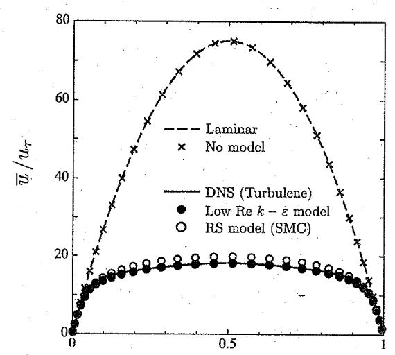  
y/H

図8.1：平行平板間流れの平均速度と壁からの距離の関係（流路幅全体の表示）  
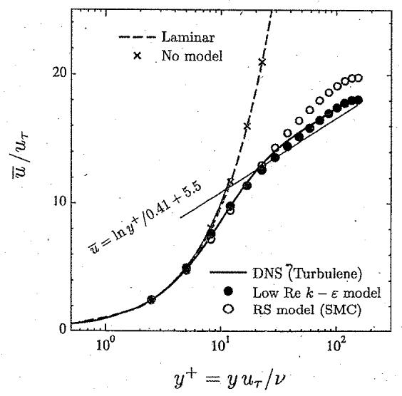  
図8.2:平行平板間流れの平均速度分布（壁近くの対数法則との比較）

使：
<table><tr><td>モデル</td><td>D</td><td>E</td><td>ε,Eの壁面境界条件</td><td>C, Cea Ca on σe</td><td>fo</td><td>h</td><td>f</td><td></td></tr><tr><td>1 Standard[Launder- 0 Spalding] (1974)</td><td></td><td>0</td><td>Wall functions</td><td>0.09 1.44 1.92 1.0 1.3 1.0</td><td></td><td>1.0</td><td>1.0</td><td></td></tr><tr><td>2 Jones-Launder(1972)</td><td>2v(∂√k/oy)</td><td>2vv(∂0/∂y)</td><td>E=0</td><td>0.09 1.55 2.0 1.0 1.3</td><td>exp(1+Rt/50) -25</td><td>1.0</td><td>1-0.3exp(−Rt²)</td><td></td></tr><tr><td>3 Launder-Sharma (1974)</td><td>2v(∂√k/0y)</td><td>2v,(20/∂y)</td><td>ε=0</td><td>0.09 1.44 1.92 1.0 1.3</td><td>exp -3.4 (1+Rt/50)</td><td>1.0</td><td>1-0.3exp(-Rt³)</td><td></td></tr><tr><td>4 Hoffmann(1975)</td><td>(vly)(akay)</td><td>0</td><td>ε=0</td><td>0.09 1.81 2.0 2.0 3.0</td><td>exp(1+R1/50) -1.75</td><td>1.0</td><td>1-0.3exp(-Rt)</td><td></td></tr><tr><td>5 Reynolds(1976)</td><td>0</td><td>0</td><td>ε=vk∂</td><td>0.084 1.0 1.83 1.69 1.3</td><td>1-exp(-0.0198Ry)</td><td>1.0</td><td>(1-0.3exp{−(Rt/3)]k(Ry)</td><td></td></tr><tr><td>6 Hassid-Poreh(1978)</td><td>22k/2</td><td>-2v(a√El∂y)</td><td>7=0</td><td>0.09 1.45 .2.0 1.0 1.3</td><td>1-exp(-0.0015Rt)</td><td>1.0</td><td>1-0.3exp(−Rt²)</td><td></td></tr><tr><td>7 Lam- Bremhorst{Diri- 0 chlet] (1981)</td><td></td><td>0</td><td>ε=vky</td><td>0.09 1.44 1.92 1.0 1.3</td><td>[1-exp(-0.0165Ry)P(1+20.5/Rt)</td><td>1+(0.05//)</td><td>1-exp(-Rt³)</td><td></td></tr><tr><td>8 Chien(1982)</td><td>2vk/²</td><td>-22(E/v)exp(-0.5y+)</td><td>ε=0</td><td>0.09 1.35.1.8 1.0 1.3</td><td>1-exp(-0.0115g+)</td><td>1.0</td><td>1−0.22exp[−(Rt/6)]</td><td></td></tr><tr><td>9 To-Humphrey(1986)</td><td>0</td><td>0</td><td>ε=2v(∂√kl∂y)</td><td>0.09 1.44 1.92 -1.0 1.3</td><td>exp(1+ i50)</td><td>1.0</td><td>{1-0.3exp(-Rt)}fs</td><td></td></tr><tr><td>10 Nagano-Hishida (1987)</td><td>2v(a√k/oy)</td><td>2()</td><td>ε=0</td><td>0.09 1.45 1.9 1.0 1.3</td><td>{1−exp(−v+/26.5)}²</td><td>1.0</td><td>1-0.3exp(-Rt²)</td><td></td></tr><tr><td>11 Myong-Kasagi(1990) 0</td><td></td><td>0</td><td>e=k</td><td>0.09. 1.4 1.8 1.4 1.3.</td><td>{1-exp(-%)(1+ 345)</td><td>1.0</td><td></td><td>[1-(2/)exp{-(R/6)}]{1-ex(-+15)}</td></tr><tr><td>12 Nagano-Tagawa (1990)</td><td>0</td><td>0</td><td>e=2v(∂√k|∂y)</td><td>0.09 1:45 1.9 1.4 1.3</td><td>{1-exp(-)(1+)</td><td>1.0</td><td></td><td>[1-0.3exp{-(R/6.5)}]{1-exp(−v+/6)}</td></tr><tr><td>13 Shih-Mansour(1990)</td><td>2v(a√kl}y)</td><td>(l</td><td>ε=vk</td><td>.0.09 1.45 2.0 1.3 1.3</td><td>1−exp(−a1y+−a2y+2−a3y+−ay+)</td><td>1.0</td><td>{1-0.22exp(-Ri²/6)}-ε/e</td><td></td></tr><tr><td>14 山(1991)</td><td>0</td><td>0</td><td>ε=k∂</td><td>0.09 1.45 1.92 1.4 1.3</td><td>{1-1(+1)[1-exp(C)+]</td><td>1.0</td><td></td><td>[1−0.3exp{−(Rt/26)}]{1-exp(−y+/4.1)}</td></tr><tr><td>15 Michelassi-Rodi (1991)</td><td>εx(-0.09Ry)</td><td>-1.2w( (20) (嘉)</td><td>=(张)</td><td>0.09 1.44 1.92 1.3 1.3</td><td>(1−exp(−0.044y+))2 (1+exp(−0.12y*))</td><td>1.0</td><td>{1−0.22ex(−Rt2/36)}·ε/s</td><td></td></tr><tr><td></td><td></td><td></td><td></td><td></td><td></td><td></td><td></td><td></td></tr><tr><td>16 Abe-Nagano(1992)</td><td>0</td><td>0</td><td>e=2v(∂√k(∂y)</td><td>0.09 1.5 1.9 1.4 1.4</td><td>{1-(/4)}1+x((/20)]</td><td>1.0</td><td></td><td>{1-ex(-/131)}[1-03exp{-(R4/6.5)}]</td></tr><tr><td>17 Yang-Shih(1993)</td><td>0</td><td>(01y)</td><td>ε=ky</td><td>0.09 1.44 1.92 1.0 1.3</td><td>{−exp(−a{Ry-aRy³-a1Ry⁵)}u辆外注参照</td><td>.1.0</td><td>1.0</td><td></td></tr><tr><td>18 村上-加藤-近本(1993)</td><td>0</td><td>0</td><td>∈=2v(∂√k(ay)</td><td>0.09 1.5 1.9 1.4 1.4</td><td>{1−exp(−y*/14)}(1+exp(−Rt4/2.4)} ×[1+1.5/Rr]</td><td>1.0</td><td></td><td>{1−exp(-/3.1)}[1-0.3exp{−(Rt/6.5)}]</td></tr></table>

## 第9章

# 乱流の数値シミュレーション（LES）

## 9.1格子平均による乱流の数値シミュレーション

乱流を数値シミュレーションで再現するためには，時間的にも空間的にも流れのすべての非定常現象(流れ場の形状から決まる流れと関連のある代表長さから最小スケールの渦まで)を解像できる計算格子を使用しなければならない。レイノルズ数が大きくなり，発達した乱流を解析対象にする場合には，さらに高解像度な計算格子が必要になる，将来の計算機性能の発達を考慮しても，ほとんどの工学的な課題で対象になる高レイノルズ数の状況においては，乱流の数値シミュレーションを実行することは事実上不可能である.

高解像度な計算格子を必要とするような状況における数値計算上の困難を緩和して，数値シミュレーションを可能にすることを目指して考案された数値解析法の1つに，「ラージエディシミュレーション」(LES)がある．LESでは，計算格子の幅より小さいスケールの流れ現象の影響をLESの乱流モデルで表現して，計算格子の幅より大きいスケールの流れのみを直接に計算する.この解析方法では，計算格子に依存して定義された空間平均を適用した基礎方程式を解くことになる．この結果，乱流モデルを用いない直接数値計算（DNS）より粗い計算格子で乱流の数値解析を実現できる.

乱流の速度場や圧力場を構成する変動成分の中で，計算格子で解像できるスケール成分をGS（GridScale)といい，それより高波数で小スケールの成分をSGS(Subgrid Scale)という. すなわち，もとの乱流場の完全な状態は，GS成分とSGS成分の合成で表現できる.前回のRANSでは，時間平均によって，乱流の解析対象の自由度を制限して，計算負荷を低減することによって，数値流体力学の工学的な利用を実現している．それに対して，LESでは，GS成分を直接の解析対象としており，すべての成分を解析するDNSより，計算負荷が小さくなることが期待できる.このとき，LES乱流モデルによって，GS成分から直接解析する対象ではないSGS成分を予測する．そして，DNSに対するLESの計算結果の精度は，LES乱流モデル（SGSモデルともいう）の性能に依存することになる.

以上の前提に基づいて，LESでは，GS成分とSGS成分に分割するために，空間フイルターの考え方を導人する，ここで，空間フィルターというと，小スケールで高波数の速度や圧力の変動成分を平滑化して，乱流場を粗視化するイメージを適切に表現していると考えられる．次章では，この空間フィルターを使用して，LESにおけるGS成分の基礎方程式の導出とSGS成分に関係するLES乱流モデルを具体的に説明する.

## 9.2 基礎方程式

格子平均による乱流の数値 $\yen 123,456$ あるLESでは，空間平均の考え方によって，乱流の速度分布 $u _ { i }$ を，空間 $7 1 \pi \times -$ を適用して抽出したGS成分 $\overline { { u } } _ { i }$ と，これ以外の小スケールの変動に対応する SGS 成分 $u _ { i } ^ { \prime }$ に分離する.

$$
u _ { i } = \overline { { u } } _ { i } + u _ { i } ^ { \prime }\tag{9.1}
$$

また，同じ空間フィルターを圧力 $p$ にも適用して，圧力のGS成分とSGS成分に分離すると，次のようになる.

$$
p = \overrightarrow { p } + p ^ { \prime }\tag{9.2}
$$

RANSの説明でも，これらと同様 $\scriptscriptstyle \mathcal { O }$ 式が使用されたが，LESでは，時間平均とそれからの変動ではな$\therefore$ 空間平均とそれからの変動であることに注意しなければならない.

通常使用されるLES乱流モデルのほとんどは，空間フ $1 \ N \not \approx - \emptyset$ 具体的な定義に依存することがなく，速度や圧力の成分を上式のように分離できることだけを前提にしている．空間フィルターには複数の形式が考案さ $\pi ( < 0 . 7 。$ が，ここではその説明を省略する。

次に，LESで解析対象になる空間フイルターを施した基礎方程式を導出する.このとき，RANSと同様の手順によるが,RANSのときとは異なり， $\overline { f } ^ { \prime } \neq 0 , \overline { f } \neq \overline { f } \cdot \overrightarrow { d } > \geq \zeta $ ，一般的には， $\overline { { \partial f / \partial x } } \neq \partial \overline { { f } } / \partial x$ であることに注意しなければなない．ただし，最後の関係の差は小さく，モデルの中に含めるとして，無視されることになる.

非定常の非圧縮性流れの基礎方程式

連続の式

$$
\frac { \partial u _ { j } } { \partial x _ { j } } = 0\tag{9.3}
$$

Navier-Stokes 方程式

$$
\frac { \partial u _ { i } } { \partial t } = - u _ { j } \frac { \partial u _ { i } } { \partial x _ { j } } - \frac { \partial p } { \partial x _ { i } } + \nu \frac { \partial ^ { 2 } u _ { i } } { \partial x _ { j } ^ { 2 } }\tag{9.4}
$$

を元にして，両式の全体に空間フィルターを適用すると，

空間フィルターを施した連続の式

$$
\frac { \partial \overline { { u } } _ { j } } { \partial x _ { j } } = 0\tag{9.5}
$$

空間フィルターを施したNavier-Stokes方程式

$$
\frac { \partial \overline { { u } } _ { i } } { \partial t } = - \overline { { u } } _ { j } \frac { \partial \overline { { u } } _ { i } } { \partial x _ { j } } - \frac { \partial \overline { { p } } } { \partial x _ { i } } + \nu \frac { \partial ^ { 2 } \overline { { u } } _ { i } } { \partial x _ { j } ^ { 2 } } - \frac { \partial \tau _ { i j } } { \partial x _ { j } }\tag{9.6}
$$

となる．ただし，これまでと同様に，便宜的に，圧力pに密度 $\rho$ を含めて表示している．この基礎方程式は，RANSと同じ形に見えるが，このときの平均を表すバーは，時間平均ではなく，計算格子のス$\gamma - \pi k$ 関係する空間平均になっている．したがって，基礎方程式が表現している物理現象の状況が，RANSとは異なっていることに注意しなければならない.

式 (9.6) の中の $\tau _ { i j }$ は，

$$
\tau _ { i j } = \overline { { \mathscr { u } _ { i } \mathscr { u } _ { j } } } - \overline { { \mathscr { u } } } _ { i } \overline { { \mathscr { u } } } _ { j }\tag{9.7}
$$

である. $z \mathcal { O } , \tau _ { i j }$ は，SGS成分の変動の効果を表しており，SGS応力と呼ばれ $. 3$ もし仮に， $\tau _ { i j }$ の変化を予測するために，その輸送方程式を導出すると，さらに高次の相関項が必要になる. $\subset \mathcal { O }$ ような繰り返しを断ち切って，低次の変数から未知の相関項を予測するLES乱流モデル（SGSモデル）が必要になる.

主なSGSモデルとして，例えば，

• Smagorinsky モデル

$$
\bullet \varkappa 1 + \sharp \vee 3 \mp \mp \varkappa ( \varkappa 1 + \sharp \vee 3 \mathrm { ~ S m a g o r i n s k y } \mp \mp \varkappa )
$$

・ スケール相似則モデル(Bardinaモデル)

• 構造関数モデル

などがある．Smagorinskyモデルは最も基本的なモデルである．ダイナミックモデルは，Smagorinskyモデルを拡張して，一般化することを目指したモデルであり，さらに，他の方法と組み合わせた多くの混合モデルが提案されている．スケール相似則モデルは，補助的に，Smagorinskyモデルと合せて使用される．また，別の考え方から導出したモデルもある.

## 9.3 Smagorinsky モデル

最も基本的であり，実際の応用例で多く採用されているLESのSGS モデルに，「Smagorinskyモデル」がある。

ある限られた状況における乱流について考えると，RANSにおける乱流モデルの定義と同様に，SGS応力 $\tau _ { i j }$ (の非等方成分）は，GS成分の速度勾配に比例すると仮定できる.

$$
\tau _ { i j } - \frac { 1 } { 3 } \delta _ { i j } \tau _ { k k } = - 2 \nu _ { e } \overline { { S } } _ { i j } \ , \qquad \overline { { S } } _ { i j } = \frac { 1 } { 2 } \left( \frac { \partial \overline { { u } } _ { i } } { \partial x _ { j } } + \frac { \partial \overline { { u } } _ { j } } { \partial x _ { i } } \right)\tag{9.8}
$$

$z \subset { \overline { { \mathbb { C } } } }$ $\nu _ { e }$ はSGS応力の渦粘性係数である．左辺第2項は，i=jのときの式が恒等的に成り立つように加えられている.この関係より，空間フイルターを施したNavier-Stokes方程式(9.6)は，

$$
\frac { \partial \overline { { u } } _ { i } } { \partial t } = - \overline { { u } } _ { j } \frac { \partial \overline { { u } } _ { i } } { \partial x _ { j } } - \frac { \partial \overline { { p } } } { \partial x _ { i } } + \frac { \partial } { \partial x _ { j } } 2 \nu \overline { { S } } _ { i j } - \frac { \partial } { \partial x _ { j } } \tau _ { i j }
$$

$$
= - { \overline { { u } } } _ { j } { \frac { \partial { \overline { { u } } } _ { i } } { \partial x _ { j } } } - { \frac { \partial } { \partial x _ { i } } } \left( { \overline { { p } } } + { \frac { 1 } { 3 } } \tau _ { k k } \right) + { \frac { \partial } { \partial x _ { j } } } \left[ 2 ( \nu + \nu _ { c } ) { \overline { { S } } } _ { i j } \right]\tag{9.9}
$$

となる。なお，LESの基礎方程式としては，右辺第2項の微分の中を，改めて，圧力と見なすことになる.したがって，この基礎方程式を解いて求めた圧力には，理論上，SGS応力の対角成分が含まれていることに注意しなければならない.

乱流のSGS成分と計算格子幅から見積もられる速度スケールと長さスケールを用いた次元解析により，SGS応力の渦粘性係数は

$$
\nu _ { e } \doteq ( C _ { s } \Delta ) ^ { 2 } | \overline { { S } } | , | \overline { { S } } | = \sqrt { 2 \overline { { S } } _ { i j } \overline { { S } } _ { i j } }\tag{9.10}
$$

と表現できる.これがSmagorinskyモデルである.ここで，Δは空間フィルター幅である．また，Sの平方根の中に2がある．例えば，平板に沿う単純なせん断流れの場合には，dū/dy以外はゼロで，$| \overline { { S } } | = | d \overline { { u } } / d y | \ \& \ \ne _ { \mathcal { F } \mathcal { T } }$ プラントルの混合長理論に帰着される．Smagorinskyモデルは，局所的な再現性に欠けるものの，モデルの定義から考えて，数値計算の安定性がよいことから，広範囲の乱流場の解析に使用されている.

ところで,式(9.10)中の $C _ { s }$ は,このモデルにおいて与えるべき唯一の無次元定数であり,Smagorinsky定数と呼ばれている．シミュレーションを実行するときに，乱流場に局所的な平衡を仮定して理論的に導出すると， $C _ { s } = 0 . 1 7 3$ になるが，実際に，乱流境界層をLESの解析対象にする場合には， $C _ { s } = 0 . 1$ が適していると言われている．このように，流れ場の状況が乱流モデルに反映されるように， $C _ { s }$ の値を調整しなければならない。

壁に沿う流れの場合のように速度のGS成分に勾配があると，SGS応力がゼロにならず，壁の表面上で速度がゼロであるという状況を再現できない。この問題を解決するために，壁の表面上でSGS応力がゼロになるように，SGS応力の渦粘性係数を補正する.

$$
\nu _ { e } = ( C _ { s } f _ { s } \Delta ) ^ { 2 } | \overline { { S } } |\tag{9.11}
$$

$z \subseteq { \overline { { C } } }$ ，補正のために減衰関数 $f _ { s }$ を導入してい $\mathfrak { z }$ .減衰関数としては，van Driest関数

$$
f _ { s } = 1 - \exp \left( \frac { - y ^ { + } } { A ^ { + } } \right)\tag{9.12}
$$

を使用することが多い。ただし， $y ^ { + }$ は壁からの距離であり，定数A+はおよそ25とする. $\Sigma \mathcal { O }$ 減衰関数は，壁からの距離だけに依存しており，局所的な乱流の状況を反映できない。しかし，壁からの距離

を見積もる方法に注意している限り，壁近くのSGS成分を減衰させるための関数形は，それほど重要にならないことが経験的に知られている。

## 9.4 ダイナミックモデル

前章のSmagorinskyモデルにおける係数 $C _ { s }$ を，経験的に決めるのではなく，変数と考えて，流れ場のGS成分の情報から自動的に決めることができれば，Smagorinskyモデルの問題点を回避できる可能性がある．このように動的に係数を決める方法を取り入れた「ダイナミックモデル」（または，ダイナミツクSmagorinskyモ $\vec { \mathcal { T } } \mathcal { V } )$ がGermanoら（1991)によって提案された.ダイナミックモデルでは，係数を決めるために，新たな空間フィルターを追加する．LESの基礎方程式を導出するための空間フィルターを「グリッドフィルター」このGS成分に対する新たな空間フィルターを「テストフィルター」と呼ぶ.

グリッドフィルターを適用したNavier-Stokes方程式(9.6)にテストフィルターを適用すると，

$$
\frac { \partial \widehat { \widetilde { u } _ { i } } } { \partial t } = - \widehat { \widetilde { u } } _ { j } \frac { \partial \widehat { \widetilde { u } _ { i } } } { \partial x _ { j } } - \frac { \partial \widehat { \overline { { p } } } } { \partial x _ { i } } + \frac { \partial } { \partial x _ { j } } \left( 2 \nu \widehat { \widetilde { S } } _ { i j } \right) - \frac { \partial } { \partial x _ { j } } T _ { i j } , \qquad T _ { i j } = \widehat { \overline { { u _ { i } u _ { j } } } } - \widehat { \overline { { u } } _ { i } } \widehat { \overline { { u } } _ { j } }\tag{9.13}
$$

となる．テストフィルターをで表示している.ここで，Germanoidentityと呼ばれる

$$
L _ { i j } = \widehat { \overline { { u } } _ { i } \overline { { u } } _ { j } } - \widehat { \overline { { u } } } _ { i } \widehat { \overline { { u } } _ { j } } = T _ { i j } - \widehat { \tau } _ { i j }\tag{9.14}
$$

を導入する.そして，Smagorinskyモデルの考え方から，

$$
\tau _ { i j } \mathrel { - } \frac { 1 } { 3 } \delta _ { i j } \tau _ { k k } = - 2 C ^ { 2 } \overline { { \Delta } } ^ { 2 } | \overline { { S } } | \overline { { S } } _ { i j }\tag{9.15}
$$

$$
T _ { i j } - \frac { 1 } { 3 } \delta _ { i j } T _ { k k } = - 2 C ^ { 2 } \widehat { \overline { { \Delta } } } ^ { 2 } | \widehat { \overline { { S } } } | \widehat { \overline { { S } } } _ { i j }\tag{9.16}
$$

とおくと，次式が得られる.

$$
\begin{array} { c } { { { \cal L } _ { i j } - \displaystyle \frac { 1 } { 3 } \delta _ { i j } { \cal L } _ { k k } \equiv \cdot { \cal L } _ { i j } ^ { a } = - 2 { \cal C } ^ { 2 } \widehat { \widehat { \Delta } } ^ { 2 } | \widehat { \widehat { S } } | \widehat { \overline { { S } } } _ { i j } + 2 { \cal C } ^ { 2 } \widehat { \overline { { \Delta } } } ^ { 2 } | \widehat { \overline { { S } } } | \overline { { S } } _ { i j } } } \\ { { { } } } \\ { { = - 2 { \cal C } ^ { 2 } \widehat { \Delta } ^ { 2 } \left( \alpha ^ { 2 } | \widehat { \overline { { S } } } | \widehat { \overline { { S } } } _ { i j } - | \widehat { \overline { { S } } } | \widehat { \overline { { S } } } _ { i j } \right) = - 2 { \cal C } ^ { 2 } M _ { i j } . } } \end{array}\tag{9.17}
$$

ここで，αはフィルター幅の比 $\widehat { \overline { { \Delta } } } / \overline { { \Delta } }$ である．両辺に $\overline { { S } } _ { i j }$ をかけて，係数を求めると，

$$
C ^ { 2 } = - \frac { 1 } { 2 } \frac { L _ { i j } ^ { a } \overline { { S } } _ { i j } } { M _ { i j } \overline { { S } } _ { i j } }\tag{9.18}
$$

となる，実際には，テンソル成分に対する代表値を最小二乗法で求めて，さらに，必要に応じて平均化する.

$$
C ^ { 2 } = - \frac { 1 } { 2 } \frac { \langle L _ { i j } ^ { a } M _ { i j } \rangle } { \langle M _ { i j } M _ { i j } \rangle }\tag{9.19}
$$

この式によって得られた係数を式(9.15)に代入して，SGS応力を求める.

ダイナミックモデルは，Smagorinskyモデルに比ベて，次のような利点がある.

・自動的にSGS渦粘性係数を決めるので，物理的な仮定を前提とするような経験定数をまったく含んでいない。

・乱れがなければ，SGS渦粘性がゼロになるので，特別な配慮をすることなく，壁付近の乱れの減衰にも，層流乱流遷移にも対応できる.

•SGS渦粘性の符号によって，GS成分とSGS成分の乱流エネルギーの輸送を双方向に考慮できる。

ただし，流れの状態に応じて係数C。が変化するということから，結果として，数値計算上の安定性が低下して，元になっているSmagorinskyモデルの利点が損なわれる恐れがある．それに対して，ダイナミックモデルを安定化するための改良も考えられるが，状況の改善に比べて，計算負荷の増加が無視できなくなることもある．以上のことから，SGSモデルの選択は，数値シミュレーションに要求されている計算結果の精度と併せて，慎重に判断しなければならない.

## 9.5 ガリレイ不変性

ガリレイ不変性（Galileaninvariance）とは，「運動に関する物理法則は，1つの慣性系のみに依存することはなく，すべての一様な並進運動に関して同等に成り立たなければならない」ということである.ある慣性系における物理現象の表現を別の慣性系に基づく表現に座標変換する方法として，ガリレイ変換（Galileantransformation）がある．地面の上に立っている場合にも，異なる一定の速度で移動している場合にも，ニュートン力学の観点から物理現象が従っている物理法則は区別されないので，いま注目している物理法則を表現している数式の計算結果は，ガリレイ変換の前後で，同一でなければならない、これは，流体現象に限ったことではなく，運動に関するニュートン力学の全般に当てはまることである．ここでは，特に，ガリレイ不変性を乱流モデルに対する必要条件として認識すべきであることを強調しておく.

新しい乱流モデルを開発する場合，または，既存の乱流モデルを拡張する場合に，その乱流モデルはガリレイ不変性を満たしていなければならない。もし満たしていなければ，そのような提案は受け入れられない.具体的な例として，流れの基礎方程式や乱流モデルの式中に，速度自身が含まれることがあってはならない.その場合には，数値シ $\yen 123,456$ 予測が，観測者達の並進運動の速度に応じて異なる結果になる。それに対して，速度に関する情報としては，速度自身ではなく，速度勾配，渦度，速度変動成分，速度時間変化（加速度）のような相対的な変化量であれば問題ない.また，圧力，温度密度は慣性系によらず不変であるので問題ないが，圧力，温度は，基準値の設定によることに注意する

## 必要がある.

これまでに提案されて広く利用されている乱流モデルは，ガリレイ不変性を満たしている．また，導出過程において，そのように式変形されてからモデル化されている．基礎方程式の変形の際，モデル化の前に，ガリレイ不変性を満たさないことを理由に，その項が削除されることもある、そのような観点に立って，これまでの乱流モデルを見直してみるとよい.

## この章のポイント

・ LESとは何か. LESで何ができるか.

・ LESにはどのような種類があるか.

• RANSとLES の違いは何か.

★LESのダイナミックモデルは何を意図したものか.どのような方法で実現したモデルか.

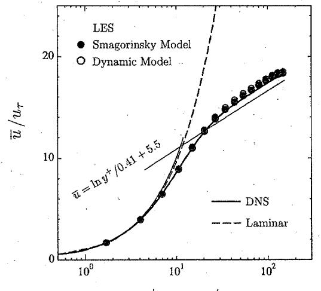  
図9.1：格子解像度をDNSの1/2にした場合のLESによる平行平板間流れの平均速度分布

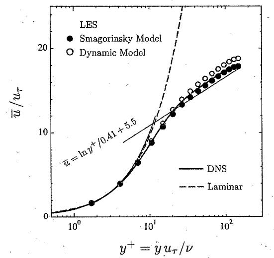  
図9.2:格子解像度をDNSの1/4にした場合のLESによる平行平板間流れの平均速度分布

# 「数値流体力学」レポート課題

## 注意事項

出題の意図を理解せずに，問いに的確に答えていない場合には，減点される.

・期待されるレポートは，配付資料と講義内容に基づく解答であり，生成AI等で得た一般論の記述ではない.

・たとえ一部でも，過去または他のレポートを写すこと，および，他に写させることは不正行為となる.

・ 他の資料から引用する場合には，必要に応じて文献リスト等を示す

## レポートの作成と提出方法

・A4用紙（シングルコラム，4ページ以内）にワープロ書きで作成し，PDFファイルとして提出する.

・ファイル名を「学籍番号-氏名.pdf」とする．ファイル形式をPDFにできない場合には，事前に相談する.

・ レポートの提出場所はUNIPAの該当ページであり，提出締め切り日時は8月5日(水)17時である.

学籍番号，所属，氏名，推敲回数を明記する.

## レポート課題

配布資料に含まれている以下の4つの問いに答えよ．（各25点，内★印5点)

・第4章「移流方程式の数値シミュレーション（上流差分)」の「この章のポイント」（24ページ)

・ 第5章「非圧縮性流れの数値解析法(MAC系解法)」の「この章のポイント」(34ページ)

または

第6章「非圧縮性流れの数値解析法(SIMPLE系解法)」の「この章のポイント」(38ページ)

・第8章「乱流の数値シミュレーション(RANS)」の「この章のポイント」(52ページ)

・第9章「乱流の数値シミュレーション(LES)」の「この章のポイント」(61ページ)

以上